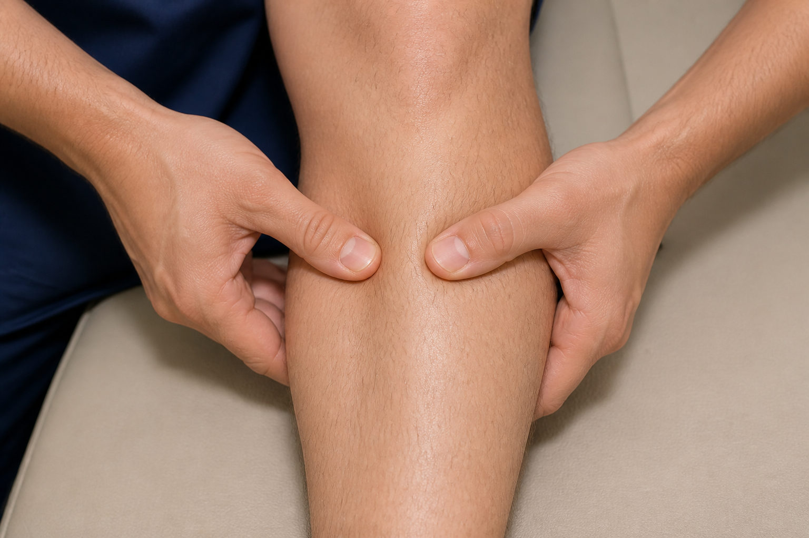
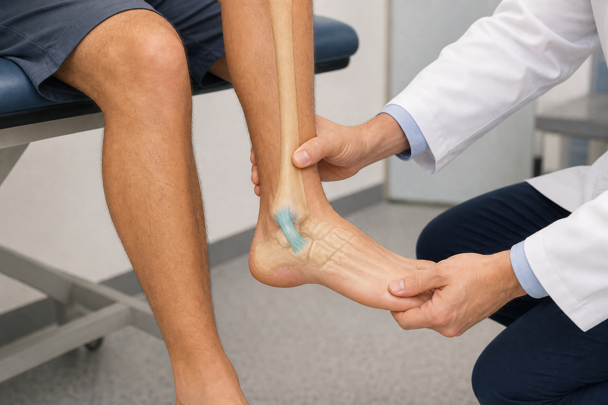
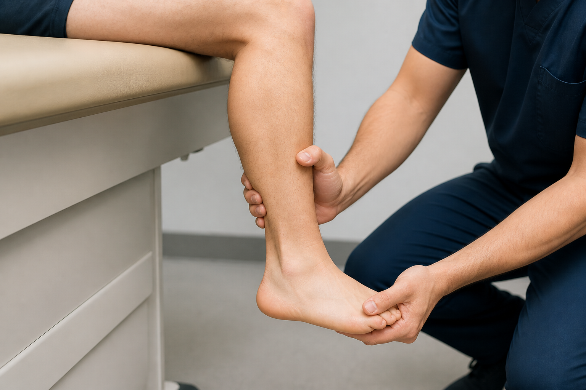
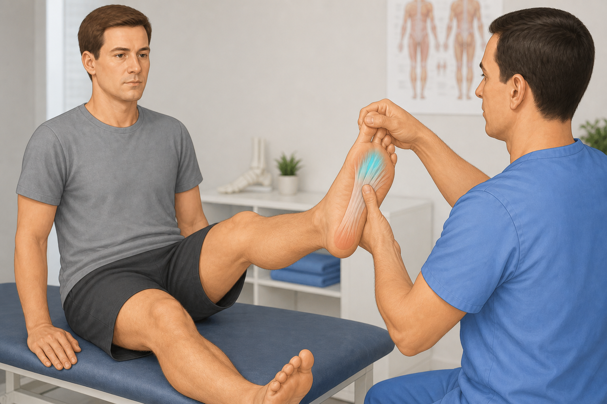
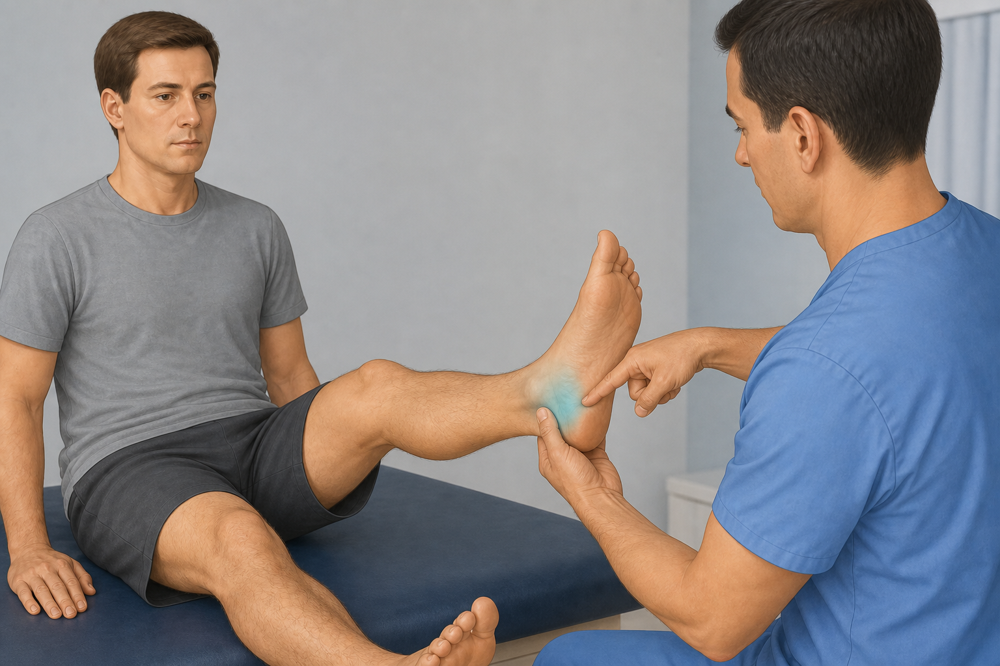

# Ankle / foot gaps — 5 core tests: starter frames + DaVinci AI prompts

**Date:** 4 Sep 2026  
**Evidence:** JOSPT ankle CPG (syndesmosis/lateral); Kleiger/talar tilt qualitative; Morton Mulder; tarsal tunnel Tinel — **never invent Sn/Sp**

**Already shipped (do not regenerate):** `thompson`, `matles`, `anterior-drawer-ankle`, `windlass`, `heel-raise`, `hop-test`

**Naming caution:** `syndesmosis-squeeze` ≠ Thompson calf squeeze (Achilles)

**No patient video (intentional):** Ottawa decision rule (questionnaire + palpation landmarks); calcaneal squeeze for stress fx (text/red-flag); wrist `tinel` must not be used for foot

For each:

1. Open the **initial image**.
2. Paste the **prompt** into DaVinci AI (image → video).
3. Export as **File out** into `public/clinical-tests/videos/`.
4. Fit Kinora logo:

```powershell
powershell -File scripts/append-kinora-logo-outro.ps1 -Only <id>.mp4
```

5. Register in `lib/clinical-test-videos.ts` (+ mobile) and upload:

```powershell
node scripts/upload-clinical-tests-storage.mjs --only=<id>.webp,videos/<id>.mp4
```

**COMMON_SUFFIX:**

> Educational physiotherapy demonstration video, realistic clinic setting, soft neutral lighting, anatomically accurate hand placement, calm professional clinician and patient, no blood, no gore, no logos, no captions, no watermarks, camera steady, 8 seconds.

---

## Checklist

| # | id | Initial image | Video out | Status |
|---|-----|---------------|-----------|--------|
| 1 | `syndesmosis-squeeze` | `syndesmosis-squeeze.png` | `syndesmosis-squeeze.mp4` | image ✅ · video ✅ (+ Kinora logo) |
| 2 | `kleiger` | `kleiger.png` | `kleiger.mp4` | image ✅ · video ✅ (+ Kinora logo) |
| 3 | `talar-tilt` | `talar-tilt.png` | `talar-tilt.mp4` | image ✅ · video ✅ (+ Kinora logo) |
| 4 | `mulder` | `mulder.png` | `mulder.mp4` | image ✅ · video ✅ (+ Kinora logo) |
| 5 | `tinel-tarsal` | `tinel-tarsal.png` | `tinel-tarsal.mp4` | image ✅ · video ✅ (+ Kinora logo) |

---

## 1. syndesmosis-squeeze



**Path:** `public/clinical-tests/syndesmosis-squeeze.png` · **Out:** `syndesmosis-squeeze.mp4`

```
Using this illustration as reference, animate the syndesmosis (tibiofibular) squeeze test: patient supine; clinician compresses the mid-calf tibia and fibula together with both hands, holds briefly, then releases; do not squeeze the Achilles tendon or calf belly like a Thompson test. Optional soft cyan highlight on the distal tibiofibular syndesmosis. Educational physiotherapy demonstration video, realistic clinic setting, soft neutral lighting, anatomically accurate hand placement, calm professional clinician and patient, no blood, no gore, no logos, no captions, no watermarks, camera steady, 8 seconds.
```

---

## 2. kleiger



**Path:** `public/clinical-tests/kleiger.png` · **Out:** `kleiger.mp4`

```
Using this illustration as reference, animate the Kleiger / external rotation test: patient seated with the lower leg hanging; clinician stabilizes the tibia and gently externally rotates the foot (optionally with slight dorsiflexion); brief hold then release. Optional soft cyan highlight on the anterior tibiofibular syndesmosis. Educational physiotherapy demonstration video, realistic clinic setting, soft neutral lighting, anatomically accurate hand placement, calm professional clinician and patient, no blood, no gore, no logos, no captions, no watermarks, camera steady, 8 seconds.
```

---

## 3. talar-tilt



**Path:** `public/clinical-tests/talar-tilt.png` · **Out:** `talar-tilt.mp4`

```
Using this illustration as reference, animate the talar tilt test: clinician stabilizes the lower leg and gently inverts the calcaneus/talus to stress the lateral ankle ligaments; brief hold then release; calm controlled motion. Optional soft cyan highlight on the lateral ankle / CFL. Educational physiotherapy demonstration video, realistic clinic setting, soft neutral lighting, anatomically accurate hand placement, calm professional clinician and patient, no blood, no gore, no logos, no captions, no watermarks, camera steady, 8 seconds.
```

---

## 4. mulder



**Path:** `public/clinical-tests/mulder.png` · **Out:** `mulder.mp4`

```
Using this illustration as reference, animate the Mulder test for Morton neuroma: clinician compresses the metatarsal heads of the forefoot side-to-side, optionally adding pressure on an interdigital space; brief hold then release. Optional soft cyan highlight on the 3rd–4th intermetatarsal space. Educational physiotherapy demonstration video, realistic clinic setting, soft neutral lighting, anatomically accurate hand placement, calm professional clinician and patient, no blood, no gore, no logos, no captions, no watermarks, camera steady, 8 seconds.
```

---

## 5. tinel-tarsal



**Path:** `public/clinical-tests/tinel-tarsal.png` · **Out:** `tinel-tarsal.mp4`

```
Using this illustration as reference, animate the tarsal tunnel Tinel test: clinician gently taps/percusses behind and below the medial malleolus over the tibial nerve pathway; show 2–3 light taps then pause. Optional soft cyan highlight on the medial ankle / tarsal tunnel. Do not show a wrist Tinel. Educational physiotherapy demonstration video, realistic clinic setting, soft neutral lighting, anatomically accurate hand placement, calm professional clinician and patient, no blood, no gore, no logos, no captions, no watermarks, camera steady, 8 seconds.
```
