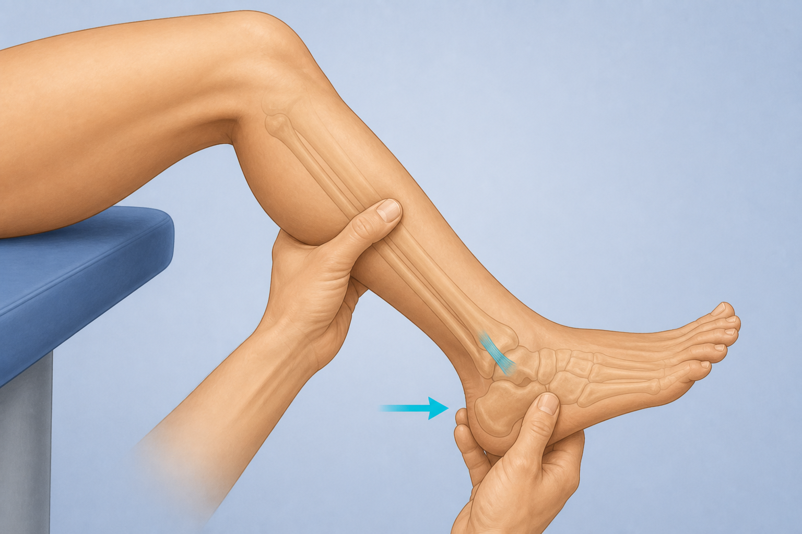
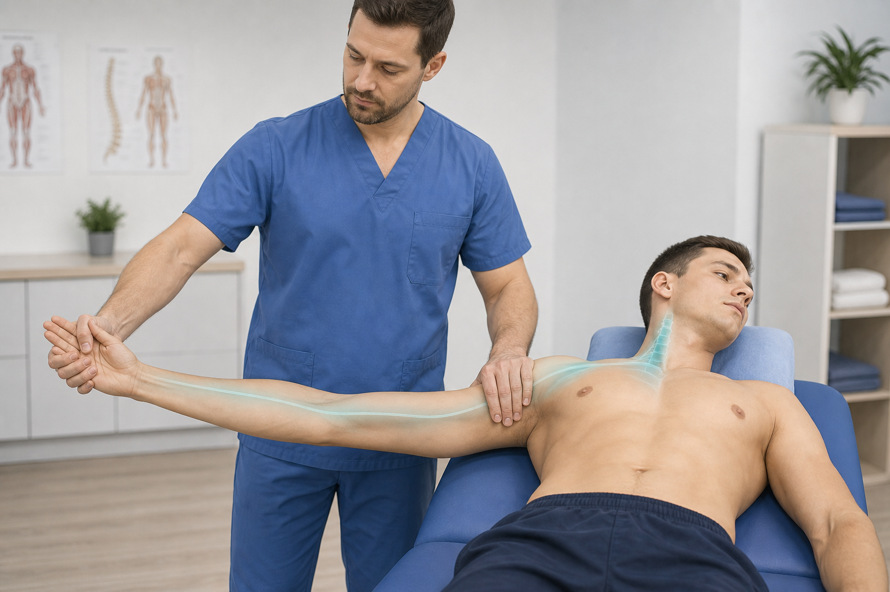

# Cajón anterior tobillo + ULTT/ULNT — improved starter frames + DaVinci prompts

**Date:** 7 Sep 2026  
**Goal:** More realistic starter frames (fewer anatomy glitches) for image→video.

| id | New starter image | Video out (keep same id when replacing) |
|----|-------------------|-------------------------------------------|
| `anterior-drawer-ankle` | [`anterior-drawer-ankle-fixed.png`](./anterior-drawer-ankle-fixed.png) (also `anterior-drawer-ankle-v2.png`) | `videos/anterior-drawer-ankle.mp4` |
| `ultt` (ULNT1 median) | [`ultt-v2.png`](./ultt-v2.png) | `videos/ultt.mp4` |

**Workflow**

1. Open the **v2** image in DaVinci / Kling / Runway as image reference.  
2. Paste the prompt below.  
3. Export 8–12s, no music/text.  
4. Fit Kinora outro:

```powershell
powershell -File scripts/append-kinora-logo-outro.ps1 -Only anterior-drawer-ankle.mp4
powershell -File scripts/append-kinora-logo-outro.ps1 -Only ultt.mp4
```

5. When happy, replace production stills (`anterior-drawer-ankle.webp`, `ultt.webp`), update CDN upload, bump video cache query if needed.

**COMMON_SUFFIX**

> Educational physiotherapy demonstration video, realistic clinic setting, soft neutral lighting, anatomically accurate hand placement, calm professional clinician and patient, no blood, no gore, no logos, no captions, no watermarks, camera steady, 8 seconds. Exactly five fingers per hand, no extra limbs, no deformed anatomy.

---

## 1. anterior-drawer-ankle (cajón anterior tobillo)



**Path:** `public/clinical-tests/anterior-drawer-ankle-fixed.png`  
**Note (7 Sep fix):** Replaced the broken “foot-on-forearm” frame. This version is one continuous thigh→knee→shin→foot. Use this for DaVinci.

### Image generation prompt (if regenerating the still)

```
Photorealistic physiotherapy textbook illustration, side view. ONE continuous adult right LEG only: thigh on blue table → bent knee with patella → calf/shin (thick gastrocnemius, NOT a forearm) → Achilles → ankle malleoli → foot with five toes. Clinician: white latex gloves (clearly separate from skin); one hand stabilizes distal shin, other cups heel and draws heel anterior. Small cyan arrow at heel; soft cyan ATFL on lateral ankle. Optional light bone overlay only at ankle/foot. No second limb, no foot grafted on an arm, no elbow-shaped knee, no text or logos.
```

### DaVinci / video prompt

```
Using this illustration as reference, animate the anterior drawer test of the ankle (cajón anterior): keep the same camera framing and the continuous thigh–knee–shin–foot anatomy; clinician stabilizes the distal tibia/fibula with one hand and gently draws the heel/talus forward with the other; ankle stays in slight plantarflexion; smooth controlled 1–2 repetitions of anterior glide then return; keep the soft cyan ATFL highlight and anterior arrow if present; do not change anatomy, do not turn the shin into a forearm, do not add extra fingers or toes, do not warp the foot. Educational physiotherapy demonstration video, realistic clinic setting, soft neutral lighting, anatomically accurate hand placement, calm professional clinician and patient, no blood, no gore, no logos, no captions, no watermarks, camera steady, 8 seconds.
```

---

## 2. ultt / ULNT1 (median bias)



**Path:** `public/clinical-tests/ultt-v2.png`

### Image generation prompt (if regenerating the still)

```
Photorealistic physiotherapy educational still, Upper Limb Tension Test ULNT1 median bias. Clean clinic, soft lighting, blue treatment table. Adult patient supine; clinician in blue scrubs stands beside the tested arm. Correct position: shoulder depressed and abducted ~90–100°, elbow fully extended, forearm supinated, wrist and fingers extended. Clinician one hand on shoulder girdle (depression), other hand holding patient wrist/hand in extension. Exactly five fingers on every hand. Optional soft cyan median-nerve pathway highlight from neck along the arm to the hand. Optional mild contralateral cervical lateral flexion. No text, logos, captions. No extra arms, no melted joints, no weird anatomy.
```

### DaVinci / video prompt

```
Using this illustration as reference, animate the upper limb tension test ULNT1 (median bias): clinician maintains scapular depression with one hand while the other gently increases then eases wrist and finger extension with the elbow kept extended and the arm abducted about 90 degrees; optional subtle contralateral neck side-bend away from the tested arm; one calm tension–release cycle; keep the soft cyan median-nerve highlight if present; do not invent extra fingers, do not bend the elbow, do not move to a different test. Educational physiotherapy demonstration video, realistic clinic setting, soft neutral lighting, anatomically accurate hand placement, calm professional clinician and patient, no blood, no gore, no logos, no captions, no watermarks, camera steady, 8 seconds.
```

---

## Notes

- **ULTT naming in app:** id stays `ultt` (aliases include `ulnt` / upper limb tension).  
- This pack is **ULNT1 / median** (most used in your cervical cluster). If you later want ULNT2b radial or ULNT3 ulnar, say so and we can make separate frames.  
- Old files `anterior-drawer-ankle.webp` / `ultt.webp` are untouched until you approve replacement.
