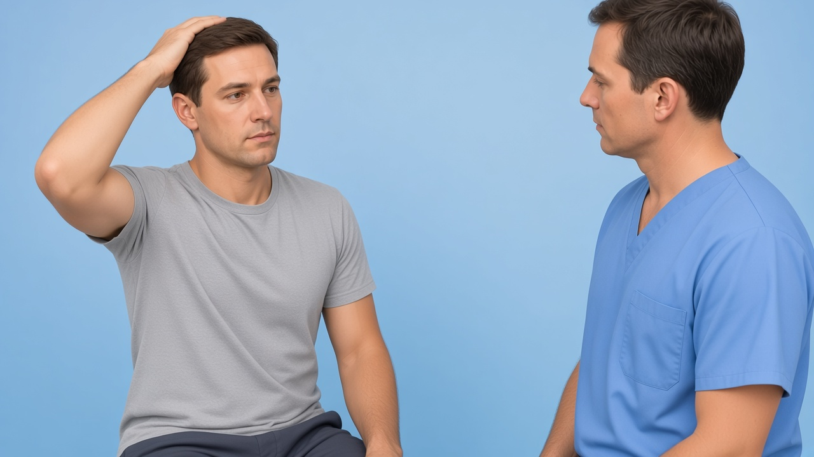

# Cervical gaps — FRT + Bakody: starter frames + DaVinci AI prompts

**Date:** 3 Sep 2026  
**Evidence:** Ogince 2007 (FRT); Bakody as qualitative Wainner complement; Sharp-Purser/alar = **text caution only** (no patient video)

For each:

1. Open the **initial image**.
2. Paste the **prompt** into DaVinci AI (image → video).
3. Export as **File out** into `public/clinical-tests/videos/`.
4. Fit logo:

```powershell
powershell -File scripts/append-kinora-logo-outro.ps1 -Only <id>.mp4
```

5. Upload + register video id in `lib/clinical-test-videos.ts` (+ mobile):

```powershell
node scripts/upload-clinical-tests-storage.mjs --only=<id>.webp,videos/<id>.mp4
```

**COMMON_SUFFIX** (included):

> CAST LOCK — same two people as Cozen / first Kinora catalog. PATIENT: adult man, short brown hair, clean-shaven, fair skin, heather-grey crew-neck t-shirt, dark charcoal shorts. CLINICIAN: adult man, short dark hair, clean-shaven, fair skin, solid medium-blue V-neck medical scrubs (top and trousers), bare hands. Same light-blue studio, blue treatment table, polished medical-illustration style. FORBIDDEN: different faces, female clinician or patient, polo, khaki, tank top, shirtless, white coat, extra people. Educational physiotherapy demonstration video, soft neutral lighting, anatomically accurate hand placement, no blood, no gore, no logos, no captions, no watermarks, camera steady, 8 seconds.

---

## Checklist

| # | id | Initial image | Video out | Status |
|---|-----|---------------|-----------|--------|
| 1 | `flexion-rotation` | `flexion-rotation.png` | `flexion-rotation.mp4` | image ✅ · video ✅ (+ Kinora logo) |
| 2 | `bakody` | `bakody.png` | `bakody.mp4` | image ✅ · video ✅ (+ Kinora logo) |
| — | Sharp-Purser / alar | — | — | **No video** (safety / mixed reliability) |

---

## 1. flexion-rotation (FRT / C1–C2)

**Initial image**


**Path:** `public/clinical-tests/flexion-rotation.png`  
**File out:** `flexion-rotation.mp4`

**Prompt (copy/paste):**

```
Using this illustration as reference, animate the cervical flexion-rotation test (FRT): patient supine; clinician gently flexes the neck to end-range (chin toward chest) to relatively lock the lower cervical segments, then passively rotates the head to one side and the other while maintaining flexion; show a clear side-to-side comparison of rotation range; stop if dizziness or neurological warning signs — do not force. Optional soft cyan highlight on C1–C2. CAST LOCK — same two people as Cozen / first Kinora catalog. PATIENT: adult man, short brown hair, clean-shaven, fair skin, heather-grey crew-neck t-shirt, dark charcoal shorts. CLINICIAN: adult man, short dark hair, clean-shaven, fair skin, solid medium-blue V-neck medical scrubs (top and trousers), bare hands. Same light-blue studio, blue treatment table, polished medical-illustration style. FORBIDDEN: different faces, female clinician or patient, polo, khaki, tank top, shirtless, white coat, extra people. Educational physiotherapy demonstration video, soft neutral lighting, anatomically accurate hand placement, no blood, no gore, no logos, no captions, no watermarks, camera steady, 8 seconds.
```

---

## 2. bakody (shoulder abduction relief)

**Initial image**



**Path:** `public/clinical-tests/bakody.png`  
**File out:** `bakody.mp4`

**Prompt (copy/paste):**

```
Using this illustration as reference, animate the Bakody / shoulder abduction relief sign: seated patient raises the symptomatic arm and places that hand on top of the head (elbow out), holds briefly to show possible relief of arm radicular symptoms, then lowers the arm; do NOT show Spurling compression or clinician pressing on the neck. Optional soft cyan highlight at the cervical foramen. CAST LOCK — same two people as Cozen / first Kinora catalog. PATIENT: adult man, short brown hair, clean-shaven, fair skin, heather-grey crew-neck t-shirt, dark charcoal shorts. CLINICIAN: adult man, short dark hair, clean-shaven, fair skin, solid medium-blue V-neck medical scrubs (top and trousers), bare hands. Same light-blue studio, blue treatment table, polished medical-illustration style. FORBIDDEN: different faces, female clinician or patient, polo, khaki, tank top, shirtless, white coat, extra people. Educational physiotherapy demonstration video, soft neutral lighting, anatomically accurate hand placement, no blood, no gore, no logos, no captions, no watermarks, camera steady, 8 seconds.
```
