# Elbow / wrist / hand — new tests: initial images + DaVinci / AI video prompts

**Date:** 31 Aug 2026  
**Gaps / AI checklist:** [`knowledge/PHYSIOGUIDE_ELBOW_WRIST_HAND_GAPS_2026-08-31.md`](../../knowledge/PHYSIOGUIDE_ELBOW_WRIST_HAND_GAPS_2026-08-31.md)  
**Source:** [Cluster pruebas codo mano](https://chatgpt.com/share/6a958c67-1718-83eb-9f6e-67b0dc37ae93)

Generate **13** videos. For each:

1. Open the **initial image** (`.png` / convert to `.webp` to match catalog).
2. Paste the **video prompt** into DaVinci AI / Kling / Runway / Luma / Sora (image → video).
3. Export as **File out** (`.mp4`).
4. Fit to 8s demo + 2s logo:

```powershell
powershell -File scripts/append-kinora-logo-outro.ps1 -Only <id>.mp4
```

5. Register id in `lib/clinical-test-images.ts` + `lib/clinical-test-videos.ts` (+ mobile) and upload:

```powershell
node scripts/upload-clinical-tests-storage.mjs --only videos/<id>.mp4
```

**COMMON_SUFFIX** (included in each video prompt):

> Educational physiotherapy demonstration video, realistic clinic setting, soft neutral lighting, anatomically accurate hand placement, calm professional clinician and patient, no blood, no gore, no logos, no captions, no watermarks, camera steady, 8 seconds.

---

## Checklist

| # | id | Initial image | Video out | Status |
|---|-----|---------------|-----------|--------|
| 1 | `maudsley` | `maudsley.webp` | `maudsley.mp4` | image ✅ · video ✅ (+ Kinora logo) |
| 2 | `durkan` | `durkan.webp` | `durkan.mp4` | image ✅ · video ✅ (+ Kinora logo) |
| 3 | `what-test` | `what-test.webp` | `what-test.mp4` | image ✅ · video ✅ (+ Kinora logo) |
| 4 | `hook-test` | `hook-test.webp` | `hook-test.mp4` | image ✅ · video ✅ |
| 5 | `moving-valgus` | `moving-valgus.webp` | `moving-valgus.mp4` | image ✅ · video ✅ |
| 6 | `milking-maneuver` | `milking-maneuver.webp` | `milking-maneuver.mp4` | image ✅ · video ✅ |
| 7 | `watson-scaphoid-shift` | `watson-scaphoid-shift.webp` | `watson-scaphoid-shift.mp4` | image ✅ · video ✅ |
| 8 | `fovea-sign` | `fovea-sign.webp` | `fovea-sign.mp4` | image ✅ · video ✅ |
| 9 | `piano-key` | `piano-key.webp` | `piano-key.mp4` | image ✅ · video ✅ |
| 10 | `froment` | `froment.webp` | `froment.mp4` | image ✅ · video ✅ |
| 11 | `jersey-finger` | `jersey-finger.webp` | `jersey-finger.mp4` | image ✅ · video ✅ |
| 12 | `mallet-finger` | `mallet-finger.webp` | `mallet-finger.mp4` | image ✅ · video ✅ |
| 13 | `trigger-a1` | `trigger-a1.webp` | `trigger-a1.mp4` | image ✅ · video ✅ |

**Already shipped (do not regenerate):** Cozen, Mill, resisted-wrist-flexion, elbow-flexion-cubital, Phalen, Tinel, Finkelstein, snuffbox, thumb-axial-load, tfcc-ulnar-load, cmc-grind, thumb-ucl-stress.

**Defer video (AI text only for now):** lateral pivot-shift / chair push-up (PLRI), LT ballottement / Kleinman / Reagan, biceps squeeze, CMC lever, Wartenberg, elbow varus stress.

---

## 1. maudsley

**Initial image**

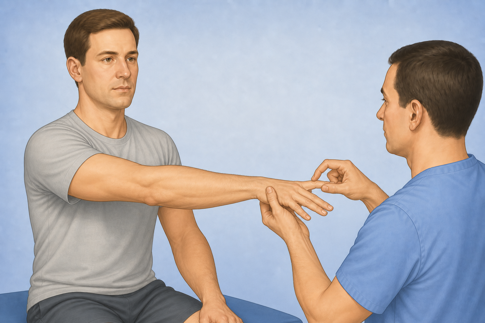

**Path:** `public/clinical-tests/maudsley.png` → prefer `maudsley.webp`  
**File out:** `maudsley.mp4`

**Prompt (copy/paste):**

```
Using this illustration as reference, animate Maudsley's test: patient extends the elbow with forearm pronated; clinician resists extension of the MIDDLE (3rd) finger only while the other fingers stay relaxed; brief clear resistance then release. Educational physiotherapy demonstration video, realistic clinic setting, soft neutral lighting, anatomically accurate hand placement, calm professional clinician and patient, no blood, no gore, no logos, no captions, no watermarks, camera steady, 8 seconds.
```

---

## 2. durkan

**Initial image**

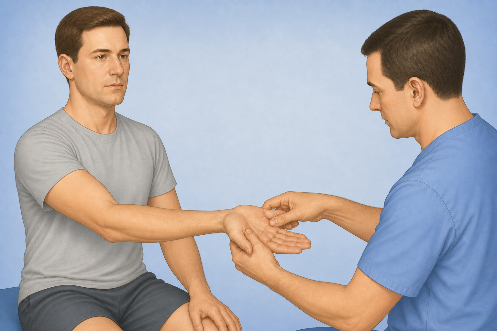

**Path:** `public/clinical-tests/durkan.png`  
**File out:** `durkan.mp4`

**Prompt (copy/paste):**

```
Using this illustration as reference, animate Durkan / carpal compression: clinician places both thumbs over the patient's carpal tunnel on the palm side of the wrist and applies steady compression for a few seconds while the patient remains still. Educational physiotherapy demonstration video, realistic clinic setting, soft neutral lighting, anatomically accurate hand placement, calm professional clinician and patient, no blood, no gore, no logos, no captions, no watermarks, camera steady, 8 seconds.
```

---

## 3. what-test

**Initial image**

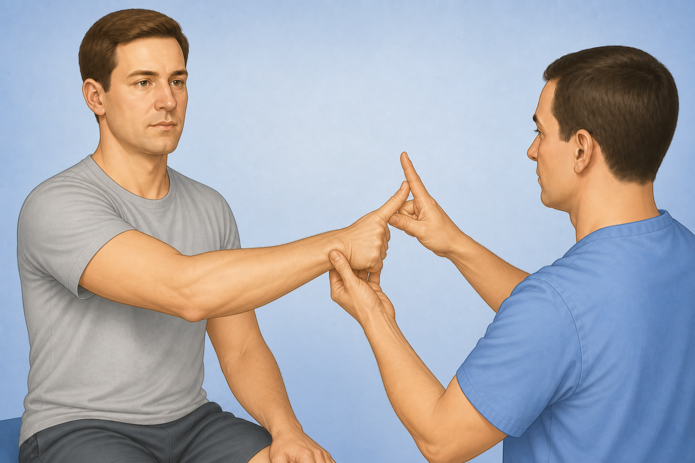

**Path:** `public/clinical-tests/what-test.png`  
**File out:** `what-test.mp4`

**Prompt (copy/paste):**

```
Using this illustration as reference, animate the WHAT test for De Quervain: clinician holds the patient's wrist in hyperflexion while the patient actively abducts the thumb against gentle resistance over the first dorsal compartment. Educational physiotherapy demonstration video, realistic clinic setting, soft neutral lighting, anatomically accurate hand placement, calm professional clinician and patient, no blood, no gore, no logos, no captions, no watermarks, camera steady, 8 seconds.
```

---

## 4. hook-test

**Initial image**

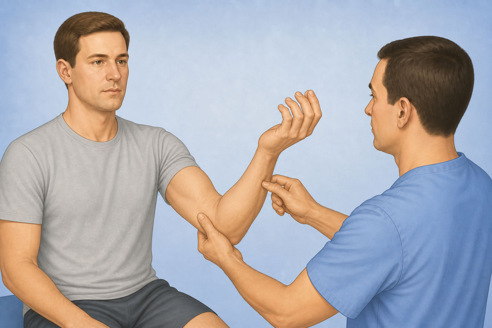

**Path:** `public/clinical-tests/hook-test.png`  
**File out:** `hook-test.mp4`

**Prompt (copy/paste):**

```
Using this illustration as reference, animate the Hook test for distal biceps: elbow flexed about 90°, forearm fully supinated; clinician slowly tries to hook an index finger under the distal biceps tendon from the lateral antecubital side. Educational physiotherapy demonstration video, realistic clinic setting, soft neutral lighting, anatomically accurate hand placement, calm professional clinician and patient, no blood, no gore, no logos, no captions, no watermarks, camera steady, 8 seconds.
```

---

## 5. moving-valgus

**Initial image**

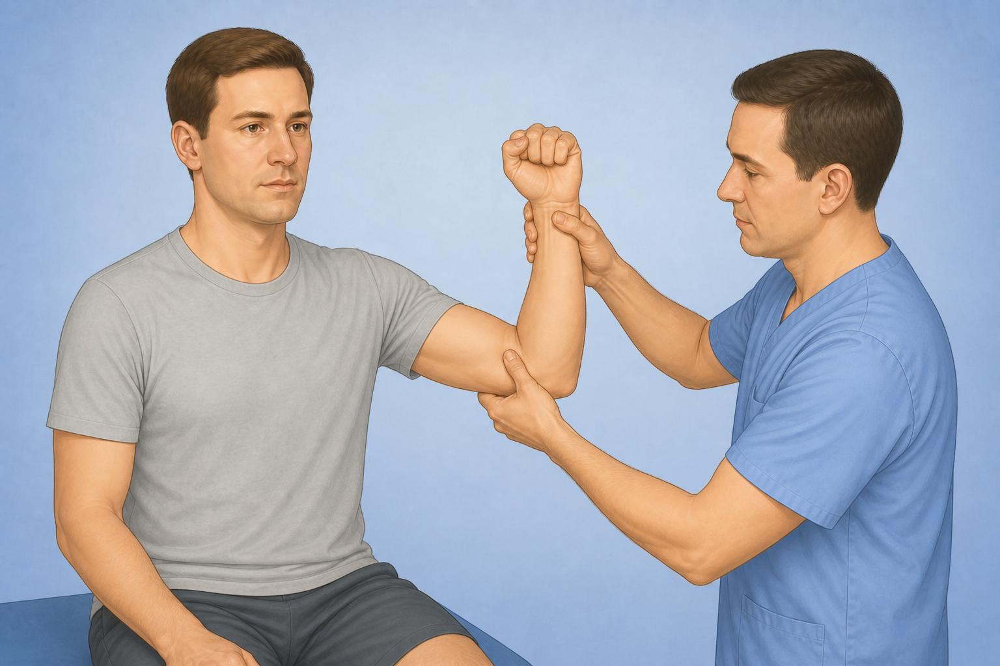

**Path:** `public/clinical-tests/moving-valgus.png`  
**File out:** `moving-valgus.mp4`

**Prompt (copy/paste):**

```
Using this illustration as reference, animate the Moving Valgus Stress Test: shoulder abducted, clinician applies constant valgus stress at the medial elbow while smoothly extending the elbow from a flexed position through about 120° to 70°. Educational physiotherapy demonstration video, realistic clinic setting, soft neutral lighting, anatomically accurate hand placement, calm professional clinician and patient, no blood, no gore, no logos, no captions, no watermarks, camera steady, 8 seconds.
```

---

## 6. milking-maneuver

**Initial image**

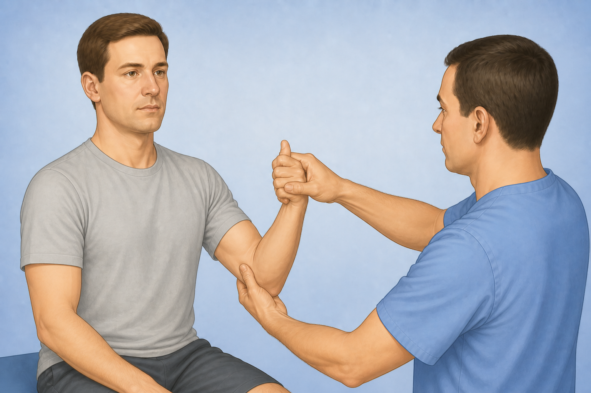

**Path:** `public/clinical-tests/milking-maneuver.png`  
**File out:** `milking-maneuver.mp4`

**Prompt (copy/paste):**

```


```

---

## 7. watson-scaphoid-shift

**Initial image**

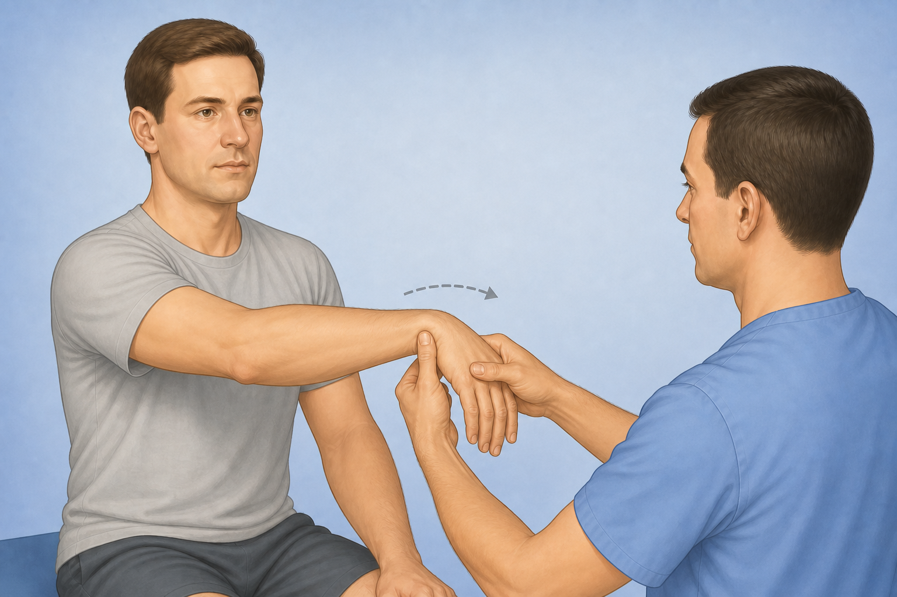

**Path:** `public/clinical-tests/watson-scaphoid-shift.png`  
**File out:** `watson-scaphoid-shift.mp4`

**Prompt (copy/paste):**

```
Using this illustration as reference, animate the Watson / scaphoid shift test: clinician's thumb presses on the scaphoid tubercle while guiding the wrist from ulnar deviation toward radial deviation in one smooth motion. Educational physiotherapy demonstration video, realistic clinic setting, soft neutral lighting, anatomically accurate hand placement, calm professional clinician and patient, no blood, no gore, no logos, no captions, no watermarks, camera steady, 8 seconds.
```

---

## 8. fovea-sign

**Initial image**


**Path:** `public/clinical-tests/fovea-sign.png`  
**File out:** `fovea-sign.mp4`

**Prompt (copy/paste):**

```
Using this illustration as reference, animate the ulnar fovea sign: clinician gently presses a fingertip into the soft ulnar fovea between the ulnar styloid and FCU/ECU, holds brief pressure, then releases. Educational physiotherapy demonstration video, realistic clinic setting, soft neutral lighting, anatomically accurate hand placement, calm professional clinician and patient, no blood, no gore, no logos, no captions, no watermarks, camera steady, 8 seconds.
```

---

## 9. piano-key

**Initial image**

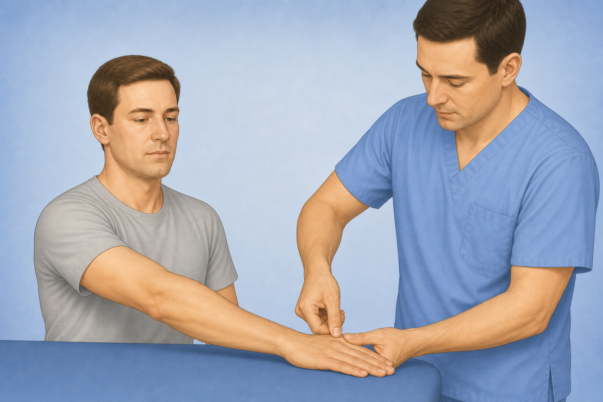

**Path:** `public/clinical-tests/piano-key.png`  
**File out:** `piano-key.mp4`

**Prompt (copy/paste):**

```
Using this illustration as reference, animate the Piano-key test for DRUJ: clinician stabilizes the radius and presses the ulnar head downward like a piano key, then lets it spring back, comparing motion gently. Educational physiotherapy demonstration video, realistic clinic setting, soft neutral lighting, anatomically accurate hand placement, calm professional clinician and patient, no blood, no gore, no logos, no captions, no watermarks, camera steady, 8 seconds.
```

---

## 10. froment

**Initial image**


**Path:** `public/clinical-tests/froment.png`  
**File out:** `froment.mp4`

**Prompt (copy/paste):**

```
Using this illustration as reference, animate Froment's sign: patient pinches a sheet of paper between thumb and index; clinician gently pulls the paper while the thumb may flex at the IP joint if adductor pollicis is weak. Educational physiotherapy demonstration video, realistic clinic setting, soft neutral lighting, anatomically accurate hand placement, calm professional clinician and patient, no blood, no gore, no logos, no captions, no watermarks, camera steady, 8 seconds.
```

---

## 11. jersey-finger

**Initial image**

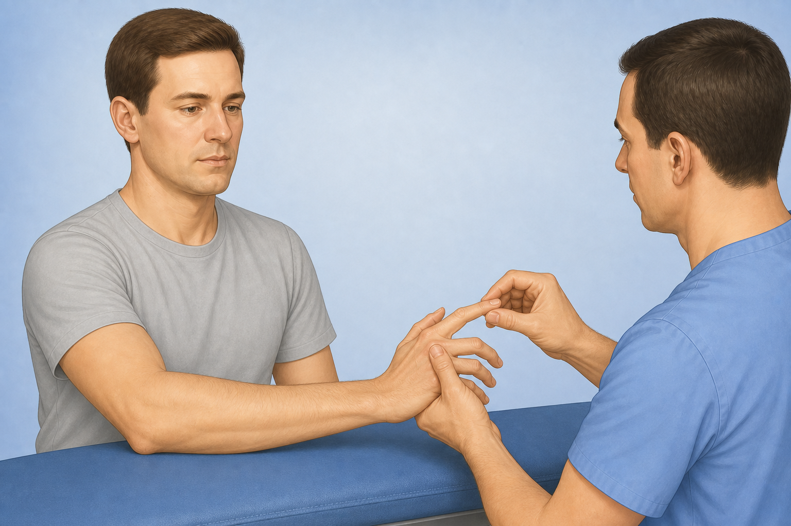

**Path:** `public/clinical-tests/jersey-finger.png`  
**File out:** `jersey-finger.mp4`

**Prompt (copy/paste):**

```
```

---

## 12. mallet-finger

**Initial image**

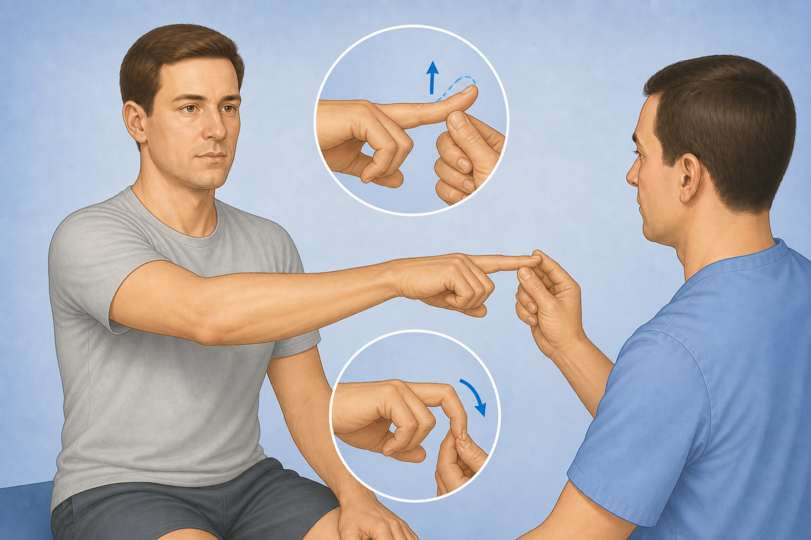

**Path:** `public/clinical-tests/mallet-finger.png`  
**File out:** `mallet-finger.mp4`

**Prompt (copy/paste):**

```
Using this illustration as reference, animate mallet finger screening: clinician supports the middle phalanx while the patient tries to actively extend the fingertip (DIP); show a short attempt where the tip may lag into flexion. Educational physiotherapy demonstration video, realistic clinic setting, soft neutral lighting, anatomically accurate hand placement, calm professional clinician and patient, no blood, no gore, no logos, no captions, no watermarks, camera steady, 8 seconds.
```

---

## 13. trigger-a1

**Initial image**

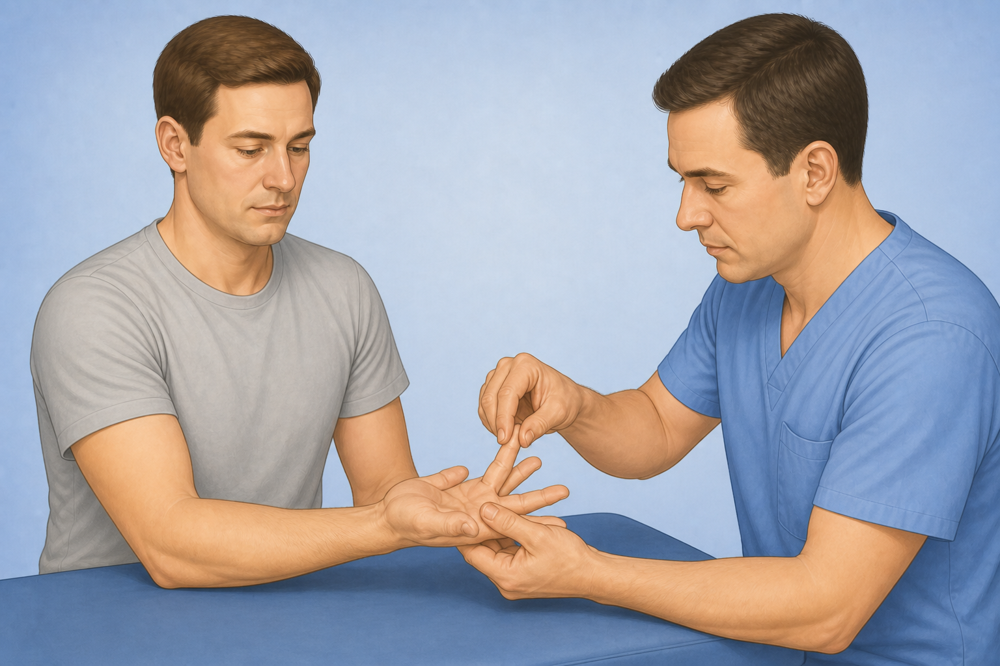

**Path:** `public/clinical-tests/trigger-a1.png`  
**File out:** `trigger-a1.mp4`

**Prompt (copy/paste):**

```
Using this illustration as reference, animate trigger finger / A1 pulley exam: clinician palpates the palmar A1 pulley at the base of a finger while the patient slowly flexes and extends the finger, watching for catching or locking. Educational physiotherapy demonstration video, realistic clinic setting, soft neutral lighting, anatomically accurate hand placement, calm professional clinician and patient, no blood, no gore, no logos, no captions, no watermarks, camera steady, 8 seconds.
```
