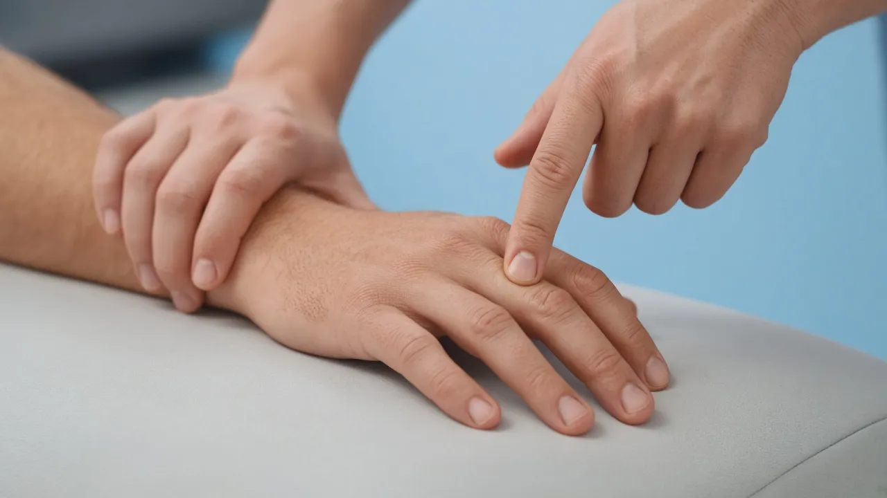
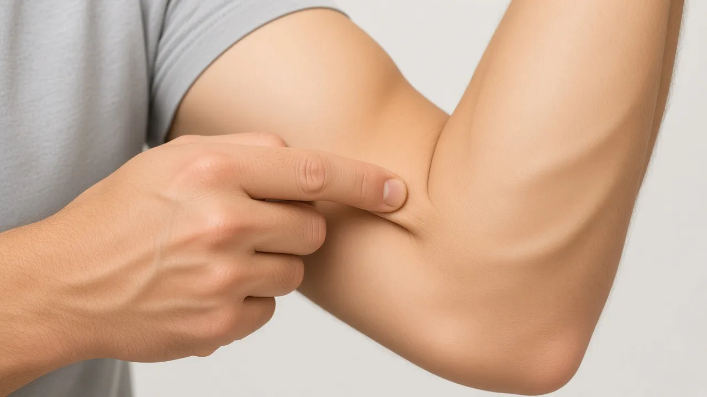
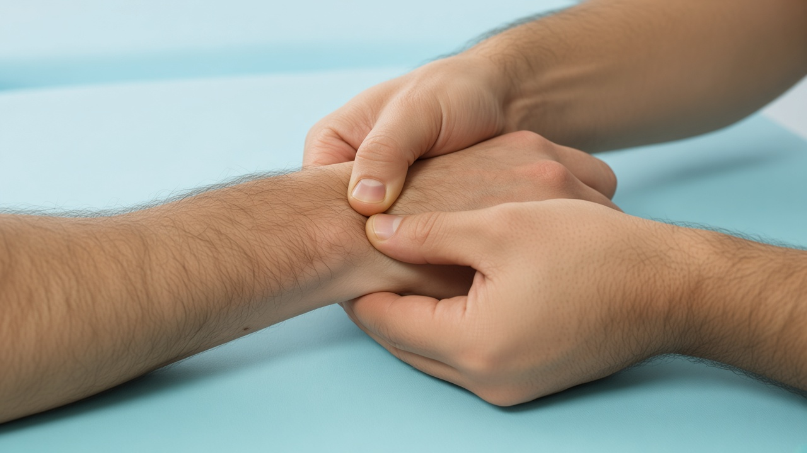

# Elbow / wrist / hand — new tests: initial images + DaVinci / AI video prompts

**Date:** 31 Aug 2026  
**Gaps / AI checklist:** [`knowledge/PHYSIOGUIDE_ELBOW_WRIST_HAND_GAPS_2026-08-31.md`](../../knowledge/PHYSIOGUIDE_ELBOW_WRIST_HAND_GAPS_2026-08-31.md)  
**Source:** [Cluster pruebas codo mano](https://chatgpt.com/share/6a958c67-1718-83eb-9f6e-67b0dc37ae93)

Generate **13** videos. For each:

1. Open the **initial image** (`.png` / convert to `.webp` to match catalog).
2. Paste the **video prompt** into DaVinci AI / Kling / Runway / Luma / Sora (image → video).
3. Export as **File out** (`.mp4`).
4. Fit to 8s demo + 2s logo:

```powershell
powershell -File scripts/append-kinora-logo-outro.ps1 -Only <id>.mp4
```

5. Register id in `lib/clinical-test-images.ts` + `lib/clinical-test-videos.ts` (+ mobile) and upload:

```powershell
node scripts/upload-clinical-tests-storage.mjs --only videos/<id>.mp4
```

**COMMON_SUFFIX** (included in each video prompt):

> CAST LOCK � same two people as Cozen / first Kinora catalog. PATIENT: adult man, short brown hair, clean-shaven, fair skin, heather-grey crew-neck t-shirt, dark charcoal shorts. CLINICIAN: adult man, short dark hair, clean-shaven, fair skin, solid medium-blue V-neck medical scrubs (top and trousers), bare hands. Same light-blue studio, blue treatment table, polished medical-illustration style. FORBIDDEN: different faces, female clinician or patient, polo, khaki, tank top, shirtless, white coat, extra people. Educational physiotherapy demonstration video, soft neutral lighting, anatomically accurate hand placement, no blood, no gore, no logos, no captions, no watermarks, camera steady, 8 seconds.

---

## Checklist

| # | id | Initial image | Video out | Status |
|---|-----|---------------|-----------|--------|
| 1 | `maudsley` | `maudsley-start.png` (table + 3rd finger) | `maudsley.mp4` | image ✅ · video ✅ (maud (1) + Kinora logo) |
| 2 | `durkan` | `durkan.webp` | `durkan.mp4` | image ✅ · video ✅ (+ Kinora logo) |
| 3 | `what-test` | `what-test-start.png` | `what-test.mp4` | image ✅ (resist pulgar hacia fuera) · video ❌ re-gen |
| 4 | `hook-test` | `hook-test-start.png` | `hook-test.mp4` | image ✅ · video ✅ (hook + pressure end anim + logo) |
| 5 | `moving-valgus` | `moving-valgus.webp` | `moving-valgus.mp4` | image ✅ · video ✅ |
| 6 | `milking-maneuver` | `milking-maneuver-start.png` | `milking-maneuver.mp4` | image ✅ (OUTWARD thumb pull) · video ❌ re-gen |
| 7 | `watson-scaphoid-shift` | `watson-scaphoid-shift.webp` | `watson-scaphoid-shift.mp4` | image ✅ · video ✅ |
| 8 | `fovea-sign` | `fovea-sign.webp` | `fovea-sign.mp4` | image ✅ · video ✅ |
| 9 | `piano-key` | `piano-key.webp` | `piano-key.mp4` | image ✅ · video ✅ (70 + Kinora) |
| 10 | `froment` | `froment.webp` | `froment.mp4` | image ✅ · video ✅ |
| 11 | `jersey-finger` | `jersey-finger.webp` | `jersey-finger.mp4` | image ✅ · video ✅ |
| 12 | `mallet-finger` | `mallet-finger.webp` | `mallet-finger.mp4` | image ✅ · video ✅ |
| 13 | `trigger-a1` | `trigger-a1.webp` | `trigger-a1.mp4` | image ✅ · video ✅ |
| 14 | `lt-ballottement` | `lt-ballottement-start.png` | `lt-ballottement.mp4` | image ✅ · video ✅ (26 + Kinora) |

**Already shipped (do not regenerate):** Cozen, Mill, resisted-wrist-flexion, Phalen, Tinel, snuffbox, thumb-axial-load, tfcc-ulnar-load, cmc-grind, thumb-ucl-stress, `finkelstein` (67), `chair-push-plri` (65), `elbow-flexion-cubital` (68 — hands in front).

**Defer video (AI text only for now):** CMC lever, Wartenberg, elbow varus stress.

---

## 1. maudsley

**Initial image** (arm ON TABLE; fisio presses 3rd finger)



**Path:** `public/clinical-tests/maudsley.webp`  
**DaVinci upload:** `c:\Users\sergi\project-ai\public\clinical-tests\maudsley-start.png`  
**File out:** `maudsley.mp4`

**Prompt (copy/paste):**

```
Using this illustration as reference, animate Maudsley's test (lateral epicondylalgia / tennis elbow). CRITICAL SETUP: patient's forearm and hand rest ON A CLINIC TABLE, palm down (pronated) — not floating in the air. Elbow nearly extended, supported by the table.

Clinician: one hand stabilizes the forearm / wrist on the table (optional thumb near the lateral epicondyle). The OTHER hand applies clear DOWNWARD PRESSURE on the patient's MIDDLE (3rd) FINGER ONLY — on the dorsum of the finger, distal to the PIP joint.

MOTION (1–7s): patient tries to EXTEND / lift the 3rd finger against that resistance while the other fingers stay relaxed on the table. Show brief resisted extension then hold. Do NOT move the elbow; do NOT press on other fingers; do NOT lift the whole hand/wrist as the main motion — the focus is resistance on the 3rd finger.

CAST LOCK � same two people as Cozen / first Kinora catalog. PATIENT: adult man, short brown hair, clean-shaven, fair skin, heather-grey crew-neck t-shirt, dark charcoal shorts. CLINICIAN: adult man, short dark hair, clean-shaven, fair skin, solid medium-blue V-neck medical scrubs (top and trousers), bare hands. Same light-blue studio, blue treatment table, polished medical-illustration style. FORBIDDEN: different faces, female clinician or patient, polo, khaki, tank top, shirtless, white coat, extra people. Educational physiotherapy demonstration video, soft neutral lighting, anatomically accurate hand placement, no blood, no gore, no logos, no captions, no watermarks, camera steady, 8 seconds.
```

---

## 2. durkan

**Initial image**


**Path:** `public/clinical-tests/durkan.png`  
**File out:** `durkan.mp4`

**Prompt (copy/paste):**

```
Using this illustration as reference, animate Durkan / carpal compression: clinician places both thumbs over the patient's carpal tunnel on the palm side of the wrist and applies steady compression for a few seconds while the patient remains still. CAST LOCK � same two people as Cozen / first Kinora catalog. PATIENT: adult man, short brown hair, clean-shaven, fair skin, heather-grey crew-neck t-shirt, dark charcoal shorts. CLINICIAN: adult man, short dark hair, clean-shaven, fair skin, solid medium-blue V-neck medical scrubs (top and trousers), bare hands. Same light-blue studio, blue treatment table, polished medical-illustration style. FORBIDDEN: different faces, female clinician or patient, polo, khaki, tank top, shirtless, white coat, extra people. Educational physiotherapy demonstration video, soft neutral lighting, anatomically accurate hand placement, no blood, no gore, no logos, no captions, no watermarks, camera steady, 8 seconds.
```

---

## 3. what-test

**DaVinci upload:** `c:\Users\sergi\project-ai\public\clinical-tests\what-test-start.png`  
**Path:** `public/clinical-tests/what-test.png`  
**File out:** `what-test.mp4`

**Movement:** wrist hyperflexed; patient pushes **pulgar hacia fuera** (abduction); fisio **resists** that outward force.

**Prompt (copy/paste):**

```
Using this illustration as reference, animate the WHAT test for De Quervain. Patient SEATED.

START (0–1s): clinician holds the patient's wrist in HYPERFLEXION (wrist bent forward). Patient's THUMB is free (not inside a fist).

MOTION (1–7s): patient actively pushes the THUMB OUTWARD (radial abduction — fuerza hacia fuera). Clinician RESISTS that outward thumb force with a finger/thumb on the outer side of the pulgar — clear resisted abduction. Keep the wrist hyperflexed.

END (7–8s): hold the resisted outward thumb push.

FORBIDDEN: Finkelstein fist-over-thumb; no resistance on the thumb; pushing the thumb inward. Camera steady, 8 seconds, no logos, no captions, no watermarks.
```

---

## 4. hook-test

**Refs:** Physiotutors Hook test ? [youtube.com/watch?v=YsqdHsuLgC4](https://www.youtube.com/watch?v=YsqdHsuLgC4) (focus: **dedo enganchado en el tend?n** + pressure at end)

**Initial image** (close-up finger under biceps tendon)



**Path:** `public/clinical-tests/hook-test.webp`  
**DaVinci upload:** `c:\Users\sergi\project-ai\public\clinical-tests\hook-test-start.png`  
**File out:** `hook-test.mp4`

**Note on close-up clip:** hooking is OK; add a clear **final pressure** on the tendon (pull/push once hooked). Re-gen with prompt below ? do not install the previous take without that end pressure unless you prefer it as-is.

**Prompt (copy/paste):**

```
Using this CLOSE-UP illustration as reference, animate the Hook test for distal biceps EXACTLY like Physiotutors (youtube YsqdHsuLgC4). Camera stays tight on the antecubital fossa ? INDEX FINGER + DISTAL BICEPS TENDON only.

SETUP: elbow flexed ~90?, forearm SUPINATED (palm up). Thick cord-like distal biceps tendon visible in the elbow crease.

PHASE A ? HOOK (0?4s):
Index finger approaches from the LATERAL side of the antecubital fossa and slides UNDER / BEHIND the distal biceps tendon (lateral ? medial), catching the tendon like a rope. Skin indents; you clearly see the finger hooked under the cord.

PHASE B ? PRESSURE ON THE TENDON (4?8s) ? CRITICAL:
Once hooked, the finger APPLIES FIRM PRESSURE / a clear anterior PULL on the tendon ? pulls the tendon forward away from the bone so the cord tents visibly under the finger. Hold that pressurized hooked position to the end. Do not just rest the finger there passively ? show a deliberate press/pull on the tendon.

HARD FAIL / DO NOT: miss the tendon; only point at it; stop after a light touch without pressure; straighten the elbow; pronate; wide full-body shot.

Educational physiotherapy demonstration, soft clinical lighting, calm motion, no blood, no gore, no logos, no captions, no watermarks, camera steady close-up, 8 seconds.
```

**Shorter alt:**

```
Hook test close-up: elbow 90?, forearm supinated. Finger hooks UNDER distal biceps tendon from lateral side, THEN applies firm forward PRESSURE / pull on the tendon so it tents. Hold. 8s, no text.
```

---

## 5. moving-valgus

**Initial image**


**Path:** `public/clinical-tests/moving-valgus.png`  
**File out:** `moving-valgus.mp4`

**Prompt (copy/paste):**

```
Using this illustration as reference, animate the Moving Valgus Stress Test: shoulder abducted, clinician applies constant valgus stress at the medial elbow while smoothly extending the elbow from a flexed position through about 120? to 70?. CAST LOCK ? same two people as Cozen / first Kinora catalog. PATIENT: adult man, short brown hair, clean-shaven, fair skin, heather-grey crew-neck t-shirt, dark charcoal shorts. CLINICIAN: adult man, short dark hair, clean-shaven, fair skin, solid medium-blue V-neck medical scrubs (top and trousers), bare hands. Same light-blue studio, blue treatment table, polished medical-illustration style. FORBIDDEN: different faces, female clinician or patient, polo, khaki, tank top, shirtless, white coat, extra people. Educational physiotherapy demonstration video, soft neutral lighting, anatomically accurate hand placement, no blood, no gore, no logos, no captions, no watermarks, camera steady, 8 seconds.
```

---

## 6. milking-maneuver

**Refs:** Physiotutors Modified Milking ? [youtube.com/watch?v=SwigwaZxBXE](https://www.youtube.com/watch?v=SwigwaZxBXE)

**DaVinci upload (START):** `c:\Users\sergi\project-ai\public\clinical-tests\milking-maneuver-start.png`  
**Last frame:** `c:\Users\sergi\project-ai\public\clinical-tests\milking-maneuver-end.png`  
**File out:** `milking-maneuver.mp4`

**Still lock:** Physiotutors layout ? clinician LEFT, patient RIGHT facing camera; Cozen cast (grey t-shirt + blue scrubs). Do not use any older profile/seated pair stills.  
**Movement:** shoulder ~70? flexion + adduction + ER; elbow ~70?100? flexion; forearm supinated. Fisio **pulls the thumb LATERALLY / OUTSIDE** (away from the body) ? valgus at the elbow.  
**DIRECTION LOCK:** thumb goes **OUT** (afuera). ? Never inward toward the chest.

**Prompt (copy/paste) ? OUTWARD direction locked:**

```
Using this illustration as reference, animate the Modified Milking Maneuver exactly like Physiotutors (SwigwaZxBXE). Patient SEATED. UCL / medial elbow test.

START (0?1s): right shoulder flexed ~70? FORWARD (not abducted out to the side), elbow flexed ~100?, shoulder in EXTERNAL ROTATION, forearm SUPINATED. Clinician: one hand supports UNDER the elbow; the other grasps the patient's THUMB.

DIRECTION ? CRITICAL SUCCESS:
The clinician PULLS the patient's THUMB LATERALLY / OUTWARD ? AWAY from the patient's body, to the OUTSIDE (like milking ? thumb goes out).
? CORRECT: thumb moves OUTSIDE / away from the torso / laterally (creates valgus at the elbow).
? FORBIDDEN: thumb moves INWARD toward the chest / midline / inside the body. That is the WRONG WAY.

MOTION (1?7s): keep shoulder ~70? and elbow ~100? FIXED. Only pull the thumb OUTWARD into more external rotation / lateral milking traction. Smooth, firm. Elbow angle does not change.

END (7?8s): hold with the thumb further OUT to the outside.

Also FORBIDDEN: straighten the elbow a lot (moving valgus); drop the shoulder; abduction out to the side at 90?. Camera steady, 8 seconds, no logos, no captions, no watermarks.
```

**Ultra-short:**

```
Milking: shoulder 70? flex, elbow 100?, ER, forearm supinated. Pull the THUMB OUTSIDE / laterally AWAY from the body. NEVER inward toward the chest. Keep elbow angle fixed. 8s, no text.
```

---

## 7. watson-scaphoid-shift

**Initial image**


**Path:** `public/clinical-tests/watson-scaphoid-shift.png`  
**File out:** `watson-scaphoid-shift.mp4`

**Prompt (copy/paste):**

```
Using this illustration as reference, animate the Watson / scaphoid shift test: clinician's thumb presses on the scaphoid tubercle while guiding the wrist from ulnar deviation toward radial deviation in one smooth motion. CAST LOCK ? same two people as Cozen / first Kinora catalog. PATIENT: adult man, short brown hair, clean-shaven, fair skin, heather-grey crew-neck t-shirt, dark charcoal shorts. CLINICIAN: adult man, short dark hair, clean-shaven, fair skin, solid medium-blue V-neck medical scrubs (top and trousers), bare hands. Same light-blue studio, blue treatment table, polished medical-illustration style. FORBIDDEN: different faces, female clinician or patient, polo, khaki, tank top, shirtless, white coat, extra people. Educational physiotherapy demonstration video, soft neutral lighting, anatomically accurate hand placement, no blood, no gore, no logos, no captions, no watermarks, camera steady, 8 seconds.
```

---

## 8. fovea-sign

**Initial image**


**Path:** `public/clinical-tests/fovea-sign.png`  
**File out:** `fovea-sign.mp4`

**Prompt (copy/paste):**

```
Using this illustration as reference, animate the ulnar fovea sign: clinician gently presses a fingertip into the soft ulnar fovea between the ulnar styloid and FCU/ECU, holds brief pressure, then releases. CAST LOCK ? same two people as Cozen / first Kinora catalog. PATIENT: adult man, short brown hair, clean-shaven, fair skin, heather-grey crew-neck t-shirt, dark charcoal shorts. CLINICIAN: adult man, short dark hair, clean-shaven, fair skin, solid medium-blue V-neck medical scrubs (top and trousers), bare hands. Same light-blue studio, blue treatment table, polished medical-illustration style. FORBIDDEN: different faces, female clinician or patient, polo, khaki, tank top, shirtless, white coat, extra people. Educational physiotherapy demonstration video, soft neutral lighting, anatomically accurate hand placement, no blood, no gore, no logos, no captions, no watermarks, camera steady, 8 seconds.
```

---

## 9. piano-key

**Initial image** (fijar **radio**; mover **c?bito** / ulnar head)


**Path:** `public/clinical-tests/piano-key.png`  
**DaVinci upload:** `c:\Users\sergi\project-ai\public\clinical-tests\piano-key-start.png`  
**File out:** `piano-key.mp4`

**Movement:** one hand **fixes the distal radius**; the other presses the **ulnar head (c?bito)** down like a piano key and lets it spring back. Test may be done in **pronation or supination** ? this clip uses the still?s **pronation** (palm down).

**Prompt (copy/paste):**

```
Using this illustration as reference, animate the Piano-key test for DRUJ instability.

CRITICAL ? FIX RADIUS, MOVE ULNA ONLY:
- One clinician hand FIRMLY STABILIZES / HOLDS the distal RADIUS (radial side) ? the radius must NOT move, slide, or roll.
- The OTHER hand presses the distal ULNAR HEAD (c?bito / pinky-side bony prominence) DOWNWARD like a piano key, then releases so it can spring back up.
- ONLY the ulna / ulnar head moves vertically. Do NOT move the radius. Do NOT twist the whole forearm as the main action. Do NOT push the carpus or fingers instead of the ulnar head.

SETUP: keep the forearm in the same PRONATION (palm down) as the illustration for this clip. (Clinically the test can also be done in supination ? do NOT switch mid-clip.)

MOTION (1?7s): clear downward press on the ulnar head ? brief hold ? release / spring-back. Repeat once gently if needed. Stabilizing hand on the radius stays locked.

CAST LOCK ? same two people as Cozen / first Kinora catalog. PATIENT: adult man, short brown hair, clean-shaven, fair skin, heather-grey crew-neck t-shirt, dark charcoal shorts. CLINICIAN: adult man, short dark hair, clean-shaven, fair skin, solid medium-blue V-neck medical scrubs (top and trousers), bare hands. Same light-blue studio, blue treatment table, polished medical-illustration style. FORBIDDEN: different faces, female clinician or patient, polo, khaki, tank top, shirtless, white coat, extra people. Educational physiotherapy demonstration video, soft neutral lighting, anatomically accurate hand placement, no blood, no gore, no logos, no captions, no watermarks, camera steady, 8 seconds.
```

---

## 10. froment

**DaVinci upload (START = LAST):** `c:\Users\sergi\project-ai\public\clinical-tests\froment-start.png`  
**File out:** `froment.mp4`

**Still lock:** hoja BETWEEN thumb and index only. Patient hand/fingers **FROZEN** — only the clinician pulls; patient resists without moving digits.

**Prompt (copy/paste):**

```
Using this illustration as the FIRST and LAST frame, animate Froment's sign as a NEARLY STATIC hold.

CRITICAL SETUP (locked for the whole clip):
- WHITE PAPER pinched BETWEEN the patient's THUMB and INDEX FINGER only (key pinch / pulgar e indice).
- Keep EXACTLY the same hand and finger pose as the start image for the full 8 seconds.
- Patient's fingers and thumb do NOT move, flex, wiggle, or change grip. No IP flexion animation. No finger morphing.

ONLY MOTION ALLOWED:
- Clinician gently PULLS the paper toward himself (small tension on the sheet).
- Patient RESISTS by holding the same pinch — isometric resistance only. The hand stays still like a photo while resisting the pull.

START to END: same pose. Optional tiny paper tension / clinician arms. Camera steady.

FORBIDDEN: any patient finger/thumb movement; bent-tip IP animation; fist; paper in the palm; dropping the paper; morphing hands. 8 seconds, no logos, no captions, no watermarks.

CAST LOCK — same two people as Cozen / first Kinora catalog. PATIENT: adult man, short brown hair, clean-shaven, fair skin, heather-grey crew-neck t-shirt, dark charcoal shorts. CLINICIAN: adult man, short dark hair, clean-shaven, fair skin, solid medium-blue V-neck medical scrubs (top and trousers), bare hands. Same light-blue studio, polished medical-illustration style. FORBIDDEN: different faces, female clinician or patient, polo, khaki, tank top, shirtless, white coat, extra people.
```

---
## 11. jersey-finger

**Initial image**


**Path:** `public/clinical-tests/jersey-finger.png`  
**File out:** `jersey-finger.mp4`

**Prompt (copy/paste):**

```
```

---

## 12. mallet-finger

**Initial image**


**Path:** `public/clinical-tests/mallet-finger.png`  
**File out:** `mallet-finger.mp4`

**Prompt (copy/paste):**

```
Using this illustration as reference, animate mallet finger screening: clinician supports the middle phalanx while the patient tries to actively extend the fingertip (DIP); show a short attempt where the tip may lag into flexion. CAST LOCK � same two people as Cozen / first Kinora catalog. PATIENT: adult man, short brown hair, clean-shaven, fair skin, heather-grey crew-neck t-shirt, dark charcoal shorts. CLINICIAN: adult man, short dark hair, clean-shaven, fair skin, solid medium-blue V-neck medical scrubs (top and trousers), bare hands. Same light-blue studio, blue treatment table, polished medical-illustration style. FORBIDDEN: different faces, female clinician or patient, polo, khaki, tank top, shirtless, white coat, extra people. Educational physiotherapy demonstration video, soft neutral lighting, anatomically accurate hand placement, no blood, no gore, no logos, no captions, no watermarks, camera steady, 8 seconds.
```

---

## 13. trigger-a1

**Initial image**


**Path:** `public/clinical-tests/trigger-a1.png`  
**File out:** `trigger-a1.mp4`

**Prompt (copy/paste):**

```
Using this illustration as reference, animate trigger finger / A1 pulley exam: clinician palpates the palmar A1 pulley at the base of a finger while the patient slowly flexes and extends the finger, watching for catching or locking. CAST LOCK � same two people as Cozen / first Kinora catalog. PATIENT: adult man, short brown hair, clean-shaven, fair skin, heather-grey crew-neck t-shirt, dark charcoal shorts. CLINICIAN: adult man, short dark hair, clean-shaven, fair skin, solid medium-blue V-neck medical scrubs (top and trousers), bare hands. Same light-blue studio, blue treatment table, polished medical-illustration style. FORBIDDEN: different faces, female clinician or patient, polo, khaki, tank top, shirtless, white coat, extra people. Educational physiotherapy demonstration video, soft neutral lighting, anatomically accurate hand placement, no blood, no gore, no logos, no captions, no watermarks, camera steady, 8 seconds.
```

---

## 14. lt-ballottement

**Ref:** Physiotutors LT ballottement / shuck — [youtube.com/watch?v=FU1gIwZF8mE](https://www.youtube.com/watch?v=FU1gIwZF8mE)

**Initial image** (both thumbs on dorsal LT interval — simple pressure / shear)



**Path:** `public/clinical-tests/lt-ballottement.png`  
**DaVinci upload:** `c:\Users\sergi\project-ai\public\clinical-tests\lt-ballottement-start.png`  
**File out:** `lt-ballottement.mp4`

**Movement:** both thumbs on the dorsal lunotriquetral interval; **apply pressure there** and gently shear one carpal vs the other (dorsal–palmar shuck). Keep it simple.

**Prompt (copy/paste):**

```
Using this illustration as reference, animate the lunotriquetral (LT) ballottement / shuck test.

CRITICAL — SIMPLE: clinician’s BOTH thumbs stay on the DORSAL wrist over the LT interval (lunate + triquetrum). APPLY CLEAR DOWNWARD PRESSURE THERE with the thumbs into those carpal bones. Then gently shear / shuck one bone relative to the other in a dorsal–palmar (up–down) direction while maintaining that pressure. Fingers stay wrapped under the wrist for grip.

FORBIDDEN: Watson / scaphoid-shift on the radial side; piano-key on the ulnar head alone; TFCC fovea poke. Stay on the LT interval under the two thumbs.

MOTION (1–7s): press → brief shear/shuck → press again. Small, clear movements. Camera steady, 8 seconds, no logos, no captions, no watermarks.
```
