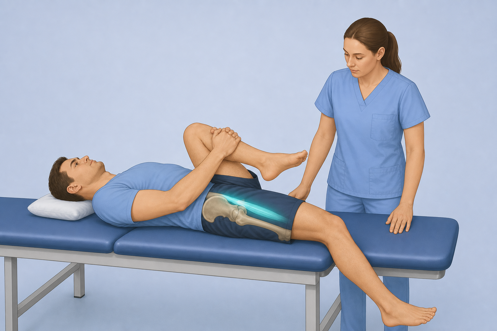
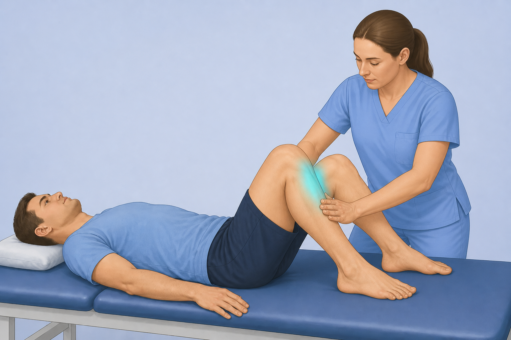
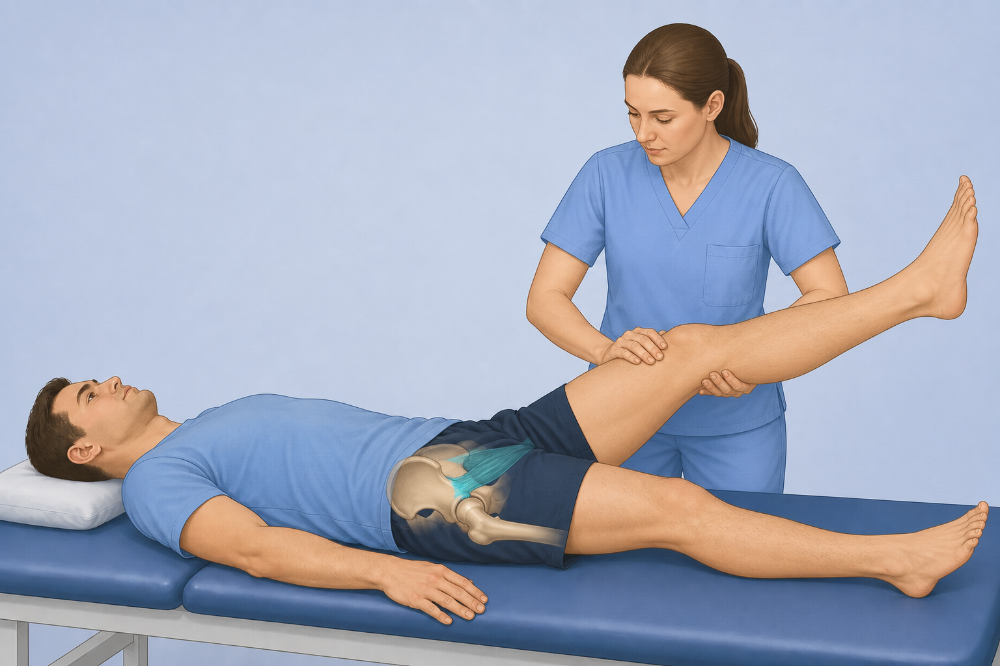
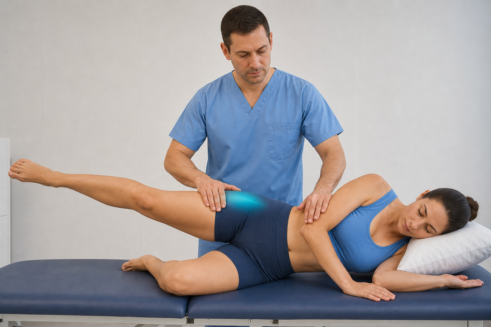
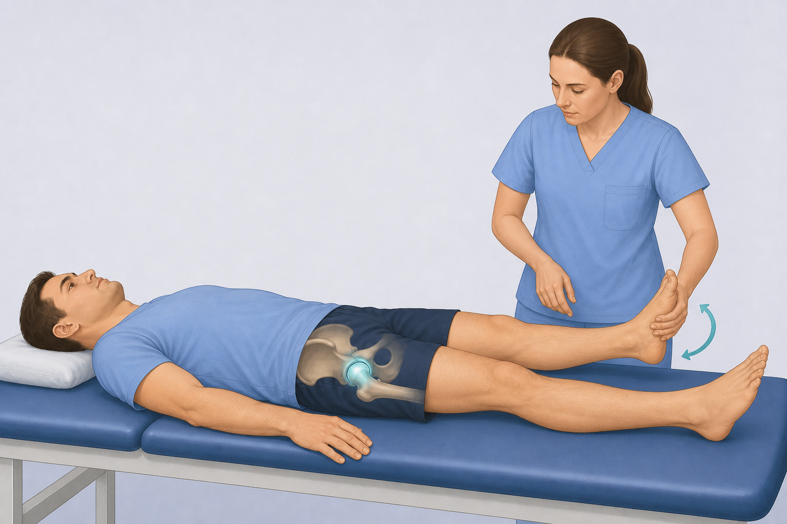
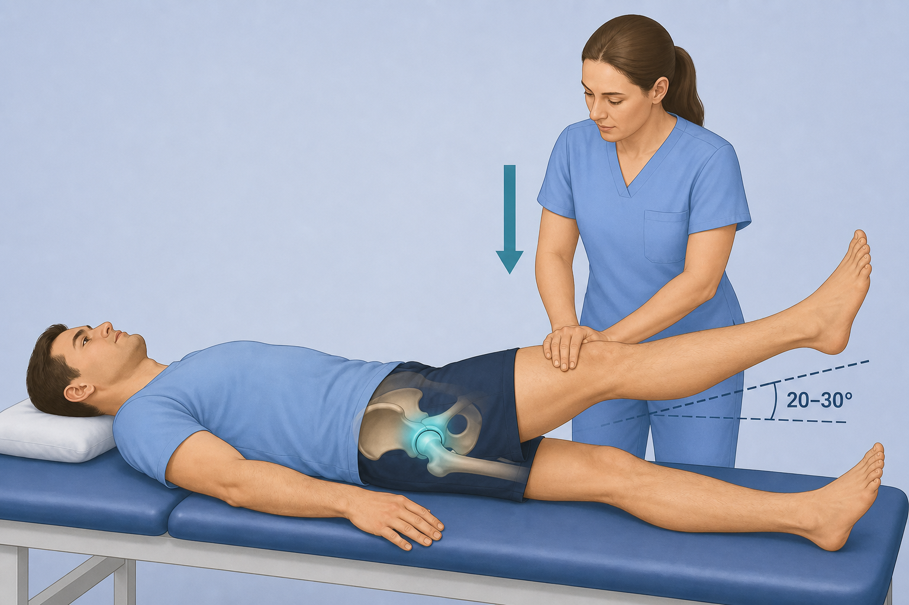
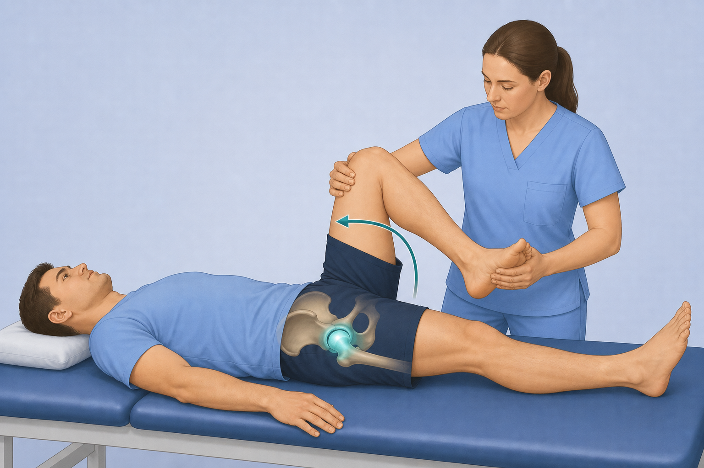

# Hip gaps — 7 core tests: starter frames + DaVinci AI prompts

**Date:** 4 Sep 2026  
**Evidence:** Doha (Weir BJSM 2015); Warwick FAIS (Griffin BJSM 2016); GTPS (Grimaldi & Fearon JOSPT 2015); Reiman hip exam reviews — **qualitative clusters only; never invent Sn/Sp**

**Already shipped (do not regenerate):** `faber`, `fadir`, `trendelenburg`, `hop-test`

**No patient video (intentional):** greater-trochanter palpation; inguinal hernia / Valsalva (referral); femoral neck stress = red-flag pattern text

For each:

1. Open the **initial image**.
2. Paste the **prompt** into DaVinci AI (image → video).
3. Export as **File out** into `public/clinical-tests/videos/`.
4. Fit Kinora logo:

```powershell
powershell -File scripts/append-kinora-logo-outro.ps1 -Only <id>.mp4
```

5. Register in `lib/clinical-test-videos.ts` (+ mobile) and upload:

```powershell
node scripts/upload-clinical-tests-storage.mjs --only=<id>.webp,videos/<id>.mp4
```

**COMMON_SUFFIX:**

> Educational physiotherapy demonstration video, realistic clinic setting, soft neutral lighting, anatomically accurate hand placement, calm professional clinician and patient, no blood, no gore, no logos, no captions, no watermarks, camera steady, 8 seconds.

---

## Checklist

| # | id | Initial image | Video out | Status |
|---|-----|---------------|-----------|--------|
| 1 | `thomas-test` | `thomas-test.png` | `thomas-test.mp4` | image ✅ · video ✅ (+ Kinora logo) |
| 2 | `resisted-adduction` | `resisted-adduction.png` | `resisted-adduction.mp4` | image ✅ · video ✅ (+ Kinora logo) |
| 3 | `resisted-hip-flexion` | `resisted-hip-flexion.png` | `resisted-hip-flexion.mp4` | image ✅ · video ✅ (+ Kinora logo) |
| 4 | `resisted-abduction` | `resisted-abduction.png` | `resisted-abduction.mp4` | image ✅ · video ✅ (+ Kinora logo) |
| 5 | `log-roll` | `log-roll.png` | `log-roll.mp4` | image ✅ · video ✅ (+ Kinora logo) |
| 6 | `stinchfield` | `stinchfield.png` | `stinchfield.mp4` | image ✅ · video ✅ (+ Kinora logo) |
| 7 | `hip-scour` | `hip-scour.png` | `hip-scour.mp4` | image ✅ · video ✅ (+ Kinora logo) |

---

## 1. thomas-test



**Path:** `public/clinical-tests/thomas-test.png` · **Out:** `thomas-test.mp4`

```
Using this illustration as reference, animate the Thomas test for hip flexors: patient supine at the table edge hugs one knee to the chest; the opposite thigh extends/lowers controlled; brief hold then slight return; do not dramatize pain. Optional soft cyan highlight on the iliopsoas/anterior hip. Educational physiotherapy demonstration video, realistic clinic setting, soft neutral lighting, anatomically accurate hand placement, calm professional clinician and patient, no blood, no gore, no logos, no captions, no watermarks, camera steady, 8 seconds.
```

---

## 2. resisted-adduction



**Path:** `public/clinical-tests/resisted-adduction.png` · **Out:** `resisted-adduction.mp4`

```
Using this illustration as reference, animate the resisted adduction / squeeze test: patient supine with hips slightly flexed; clinician resists between the knees as the patient gently squeezes the knees together; brief hold then release. Optional soft cyan highlight on the medial groin/adductors. Educational physiotherapy demonstration video, realistic clinic setting, soft neutral lighting, anatomically accurate hand placement, calm professional clinician and patient, no blood, no gore, no logos, no captions, no watermarks, camera steady, 8 seconds.
```

---

## 3. resisted-hip-flexion



**Path:** `public/clinical-tests/resisted-hip-flexion.png` · **Out:** `resisted-hip-flexion.mp4`

```
Using this illustration as reference, animate resisted hip flexion: patient supine attempts to lift the leg into hip flexion while the clinician applies controlled downward resistance on the distal thigh; brief hold then release. Optional soft cyan highlight on the iliopsoas/anterior hip. Educational physiotherapy demonstration video, realistic clinic setting, soft neutral lighting, anatomically accurate hand placement, calm professional clinician and patient, no blood, no gore, no logos, no captions, no watermarks, camera steady, 8 seconds.
```

---

## 4. resisted-abduction



**Path:** `public/clinical-tests/resisted-abduction.png` · **Out:** `resisted-abduction.mp4`

```
Using this illustration as reference, animate resisted hip abduction for GTPS: patient side-lying; top leg gently abducts against clinician resistance at the lateral distal thigh; brief hold then release. Optional soft cyan highlight on the greater trochanter / gluteus medius. Educational physiotherapy demonstration video, realistic clinic setting, soft neutral lighting, anatomically accurate hand placement, calm professional clinician and patient, no blood, no gore, no logos, no captions, no watermarks, camera steady, 8 seconds.
```

---

## 5. log-roll



**Path:** `public/clinical-tests/log-roll.png` · **Out:** `log-roll.mp4`

```
Using this illustration as reference, animate the passive log roll test: patient supine with hip and knee extended; clinician gently rolls the whole leg into internal then external rotation by guiding the ankle/foot; slow calm motion, brief hold each way. Optional soft cyan highlight on the hip joint. Educational physiotherapy demonstration video, realistic clinic setting, soft neutral lighting, anatomically accurate hand placement, calm professional clinician and patient, no blood, no gore, no logos, no captions, no watermarks, camera steady, 8 seconds.
```

---

## 6. stinchfield



**Path:** `public/clinical-tests/stinchfield.png` · **Out:** `stinchfield.mp4`

```
Using this illustration as reference, animate the Stinchfield test: patient supine lifts a straight leg about 20–30°; clinician applies controlled downward resistance on the distal thigh; brief hold then lower. Optional soft cyan highlight on the deep anterior hip. Educational physiotherapy demonstration video, realistic clinic setting, soft neutral lighting, anatomically accurate hand placement, calm professional clinician and patient, no blood, no gore, no logos, no captions, no watermarks, camera steady, 8 seconds.
```

---

## 7. hip-scour



**Path:** `public/clinical-tests/hip-scour.png` · **Out:** `hip-scour.mp4`

```
Using this illustration as reference, animate the hip scour / quadrant test: patient supine, hip flexed; clinician applies gentle axial compression along the femur while sweeping a small controlled arc (adduction↔abduction); calm professional motion, not aggressive, do not dramatize pain. Optional soft cyan highlight on the hip joint. Educational physiotherapy demonstration video, realistic clinic setting, soft neutral lighting, anatomically accurate hand placement, calm professional clinician and patient, no blood, no gore, no logos, no captions, no watermarks, camera steady, 8 seconds.
```
