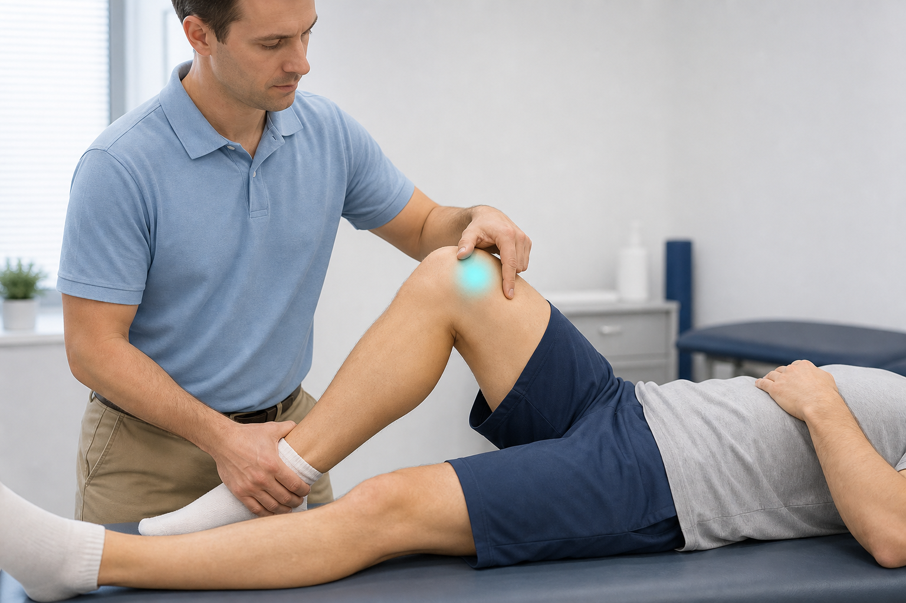
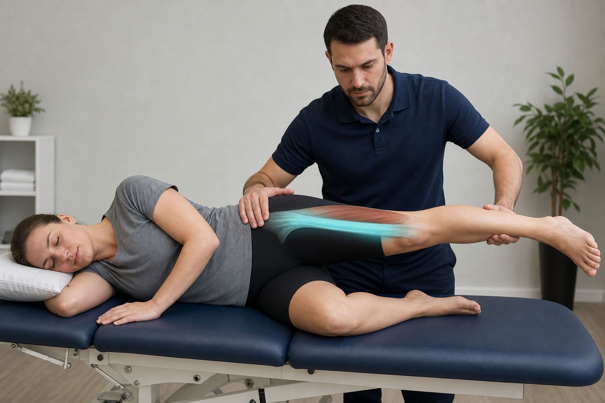
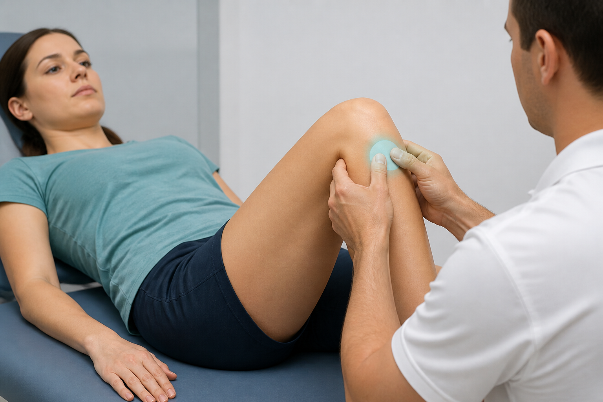
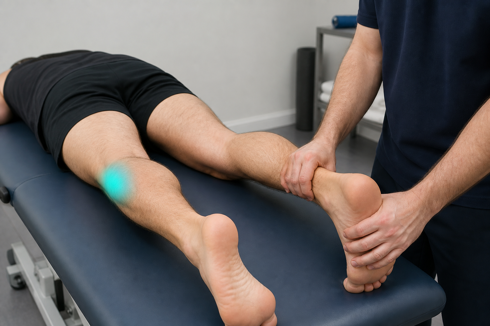

# Knee gaps — Noble / Ober / apprehension / dial: starter frames + DaVinci AI prompts

**Date:** 4 Sep 2026  
**Evidence:** ITBS running reviews (Noble/Ober = qualitative support); patellar instability clinical exam; LaPrade/Cooper PLC dial — **never invent Sn/Sp**

**Already shipped (do not regenerate):** `lachman`, `anterior-drawer-knee`, `pivot-shift`, `mcmurray`, `thessaly`, `valgus-stress-mcl`, `varus-stress-lcl`, `posterior-drawer-pcl`

**No patient video (intentional):** acute aggressive pivot if severe pain/swelling (edu video exists — don’t push as self-test); pes/Baker palpation; Clarke/grind (weak isolated utility)

For each:

1. Open the **initial image**.
2. Paste the **prompt** into DaVinci AI (image → video).
3. Export as **File out** into `public/clinical-tests/videos/`.
4. Fit Kinora logo:

```powershell
powershell -File scripts/append-kinora-logo-outro.ps1 -Only <id>.mp4
```

5. Register in `lib/clinical-test-videos.ts` (+ mobile) and upload:

```powershell
node scripts/upload-clinical-tests-storage.mjs --only=<id>.webp,videos/<id>.mp4
```

**COMMON_SUFFIX:**

> Educational physiotherapy demonstration video, realistic clinic setting, soft neutral lighting, anatomically accurate hand placement, calm professional clinician and patient, no blood, no gore, no logos, no captions, no watermarks, camera steady, 8 seconds.

---

## Checklist

| # | id | Initial image | Video out | Status |
|---|-----|---------------|-----------|--------|
| 1 | `noble-compression` | `noble-compression.png` | `noble-compression.mp4` | image ✅ · video ✅ (+ Kinora logo) |
| 2 | `ober-test` | `ober-test.png` | `ober-test.mp4` | image ✅ · video ✅ (+ Kinora logo) |
| 3 | `patellar-apprehension` | `patellar-apprehension.png` | `patellar-apprehension.mp4` | image ✅ · video ✅ (+ Kinora logo) |
| 4 | `dial-test` | `dial-test.png` | `dial-test.mp4` | image ✅ · video ✅ (+ Kinora logo) |

---

## 1. noble-compression



**Path:** `public/clinical-tests/noble-compression.png` · **Out:** `noble-compression.mp4`

```
Using this illustration as reference, animate the Noble compression test for IT band syndrome: patient supine or semi-reclined with the knee near 30° flexion; clinician compresses the lateral femoral epicondyle / ITB while gently flexing and extending the knee a small amount; brief hold then release; do not dramatize pain. Optional soft cyan highlight on the lateral condyle/ITB. Educational physiotherapy demonstration video, realistic clinic setting, soft neutral lighting, anatomically accurate hand placement, calm professional clinician and patient, no blood, no gore, no logos, no captions, no watermarks, camera steady, 8 seconds.
```

---

## 2. ober-test



**Path:** `public/clinical-tests/ober-test.png` · **Out:** `ober-test.mp4`

```
Using this illustration as reference, animate the Ober test: patient side-lying with the bottom hip flexed for stability; clinician supports the top leg, gently abducts and extends the hip, then slowly lowers the leg into adduction; calm controlled motion. Optional soft cyan highlight on the IT band / TFL. Educational physiotherapy demonstration video, realistic clinic setting, soft neutral lighting, anatomically accurate hand placement, calm professional clinician and patient, no blood, no gore, no logos, no captions, no watermarks, camera steady, 8 seconds.
```

---

## 3. patellar-apprehension



**Path:** `public/clinical-tests/patellar-apprehension.png` · **Out:** `patellar-apprehension.mp4`

```
Using this illustration as reference, animate the patellar apprehension test: patient supine with the knee slightly flexed (~20–30°); clinician gently pushes the patella laterally with the thumbs; show a brief hold then release; calm professional motion, do not dramatize pain or dislocation. Optional soft cyan highlight on the patella. Educational physiotherapy demonstration video, realistic clinic setting, soft neutral lighting, anatomically accurate hand placement, calm professional clinician and patient, no blood, no gore, no logos, no captions, no watermarks, camera steady, 8 seconds.
```

---

## 4. dial-test



**Path:** `public/clinical-tests/dial-test.png` · **Out:** `dial-test.mp4`

```
Using this illustration as reference, animate the dial test for the posterolateral corner: patient prone; both knees flexed about 30°; clinician gently externally rotates both feet/tibias and holds briefly to compare sides; optional second brief beat at ~90° knee flexion with the same external rotation compare; calm controlled motion. Optional soft cyan highlight on the posterolateral knee. Educational physiotherapy demonstration video, realistic clinic setting, soft neutral lighting, anatomically accurate hand placement, calm professional clinician and patient, no blood, no gore, no logos, no captions, no watermarks, camera steady, 8 seconds.
```
