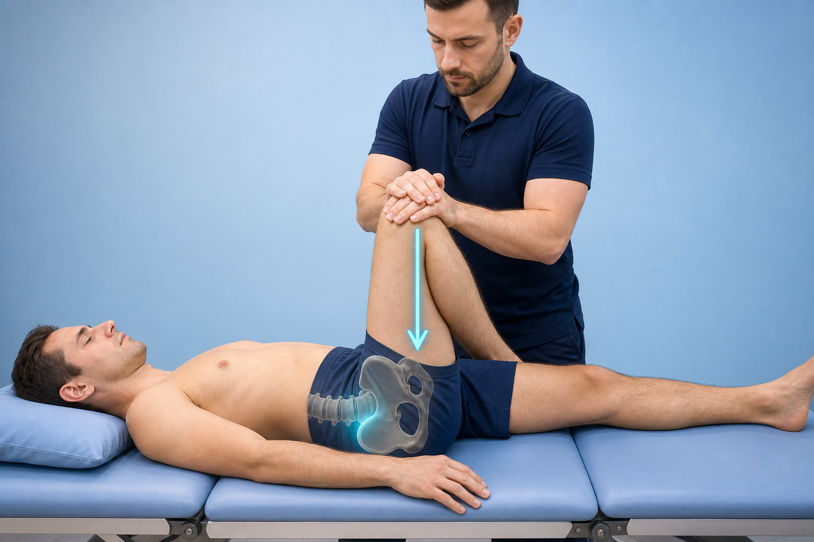
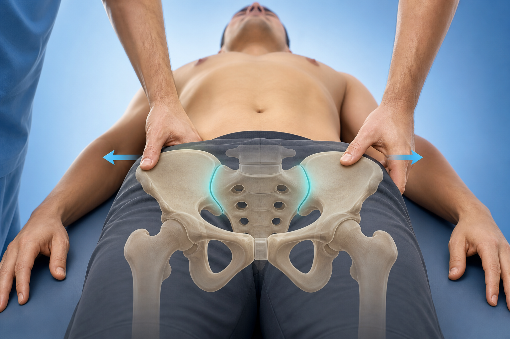
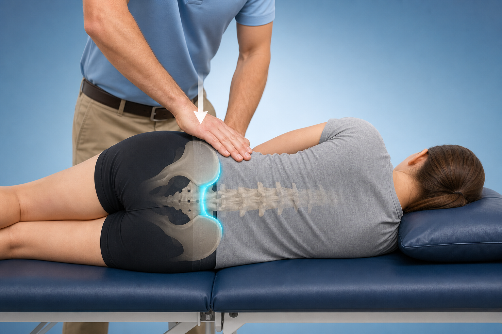
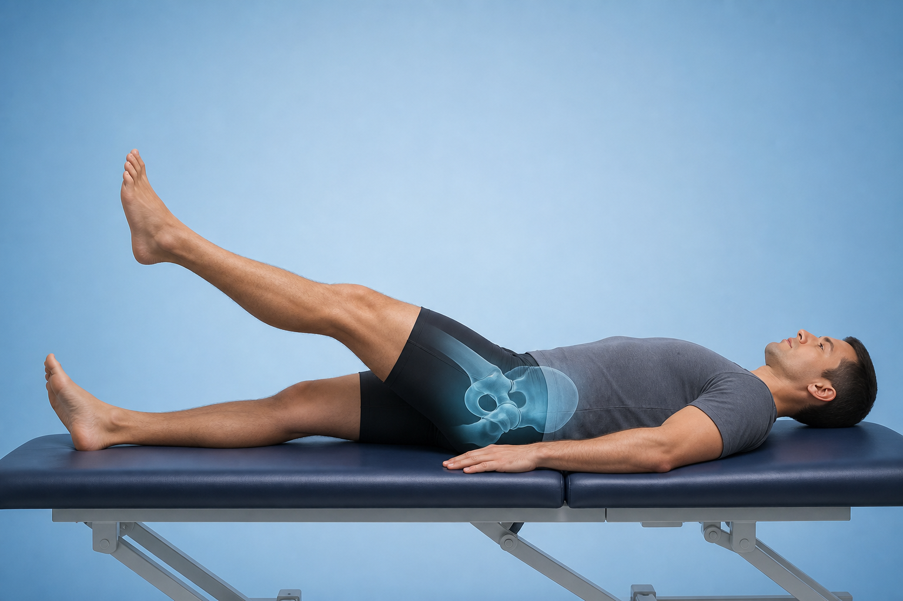

# Lumbar / SI gaps — Laslett + ASLR: starter frames + DaVinci AI prompts

**Date:** 3 Sep 2026  
**Evidence:** Laslett SI provocation composite (**mixed** precision — never invent Sn/Sp); Fortin maps; Mens ASLR / PGP; JOSPT LBP directional preference (text only, no video required)

**Already shipped (do not regenerate):** `slr-lasegue`, `crossed-slr`, `kemp`, `faber`, `schober`

**No patient video:** cauda screening; sacral thrust / Gaenslen optional later (more aggressive / clinician-only)

For each:

1. Open the **initial image**.
2. Paste the **prompt** into DaVinci AI.
3. Export `videos/<id>.mp4` → Kinora logo:

```powershell
powershell -File scripts/append-kinora-logo-outro.ps1 -Only <id>.mp4
```

4. Register in `lib/clinical-test-videos.ts` (+ mobile) and upload.

**COMMON_SUFFIX:**

> Educational physiotherapy demonstration video, realistic clinic setting, soft neutral lighting, anatomically accurate hand placement, calm professional clinician and patient, no blood, no gore, no logos, no captions, no watermarks, camera steady, 8 seconds.

---

## Checklist

| # | id | Initial image | Video out | Status |
|---|-----|---------------|-----------|--------|
| 1 | `thigh-thrust` | `thigh-thrust.png` | `thigh-thrust.mp4` | image ✅ · video ✅ (+ Kinora logo) |
| 2 | `si-distraction` | `si-distraction.png` | `si-distraction.mp4` | image ✅ · video ✅ (+ Kinora logo) |
| 3 | `si-compression` | `si-compression.png` | `si-compression.mp4` | image ✅ · video ✅ (+ Kinora logo) |
| 4 | `active-slr` | `active-slr.png` | `active-slr.mp4` | image ✅ · video ✅ (+ Kinora logo) |

---

## 1. thigh-thrust



**Path:** `public/clinical-tests/thigh-thrust.png` · **Out:** `thigh-thrust.mp4`

```
Using this illustration as reference, animate the thigh thrust (posterior shear) sacroiliac provocation test: patient supine, hip flexed about 90°, clinician applies a controlled axial push along the femur toward the table; show a brief hold then release; do not dramatize pain. Optional soft cyan highlight on the SI joint. Educational physiotherapy demonstration video, realistic clinic setting, soft neutral lighting, anatomically accurate hand placement, calm professional clinician and patient, no blood, no gore, no logos, no captions, no watermarks, camera steady, 8 seconds.
```

---

## 2. si-distraction



**Path:** `public/clinical-tests/si-distraction.png` · **Out:** `si-distraction.mp4`

```
Using this illustration as reference, animate the sacroiliac distraction (gapping) test: patient supine; clinician places hands on both ASIS and applies a controlled outward / cross-arm pressure; brief hold then release. Optional soft cyan highlight on the SI joints. Educational physiotherapy demonstration video, realistic clinic setting, soft neutral lighting, anatomically accurate hand placement, calm professional clinician and patient, no blood, no gore, no logos, no captions, no watermarks, camera steady, 8 seconds.
```

---

## 3. si-compression



**Path:** `public/clinical-tests/si-compression.png` · **Out:** `si-compression.mp4`

```
Using this illustration as reference, animate the sacroiliac compression test: patient side-lying; clinician applies a controlled downward pressure on the iliac crest toward the table; brief hold then release. Optional soft cyan highlight on the SI joint. Educational physiotherapy demonstration video, realistic clinic setting, soft neutral lighting, anatomically accurate hand placement, calm professional clinician and patient, no blood, no gore, no logos, no captions, no watermarks, camera steady, 8 seconds.
```

---

## 4. active-slr



**Path:** `public/clinical-tests/active-slr.png` · **Out:** `active-slr.mp4`

```
Using this illustration as reference, animate the active straight leg raise (ASLR) for pelvic girdle pain: single continuous scene — patient supine lifts one straight leg a short distance off the table, holds briefly, then lowers; calm controlled motion, no kicking, no split-screen, no second panel with pelvic compression. Optional soft cyan pelvic highlight. Educational physiotherapy demonstration video, realistic clinic setting, soft neutral lighting, anatomically accurate hand placement, calm professional clinician and patient, no blood, no gore, no logos, no captions, no watermarks, camera steady, 8 seconds.
```
