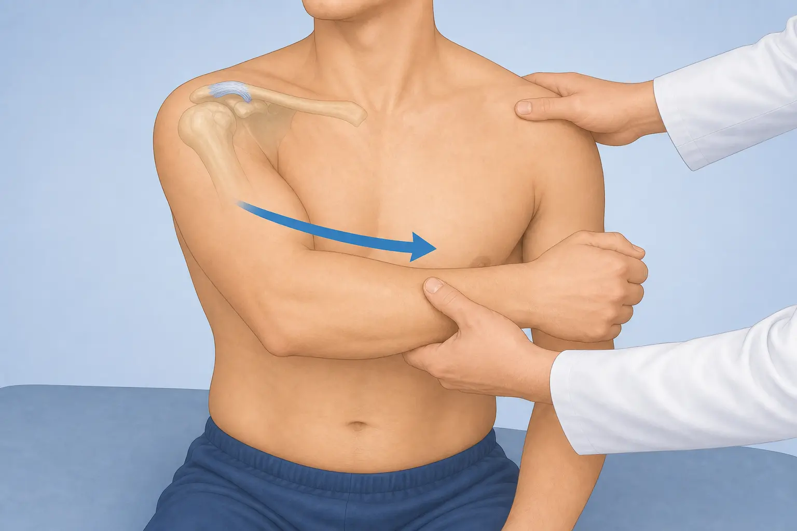
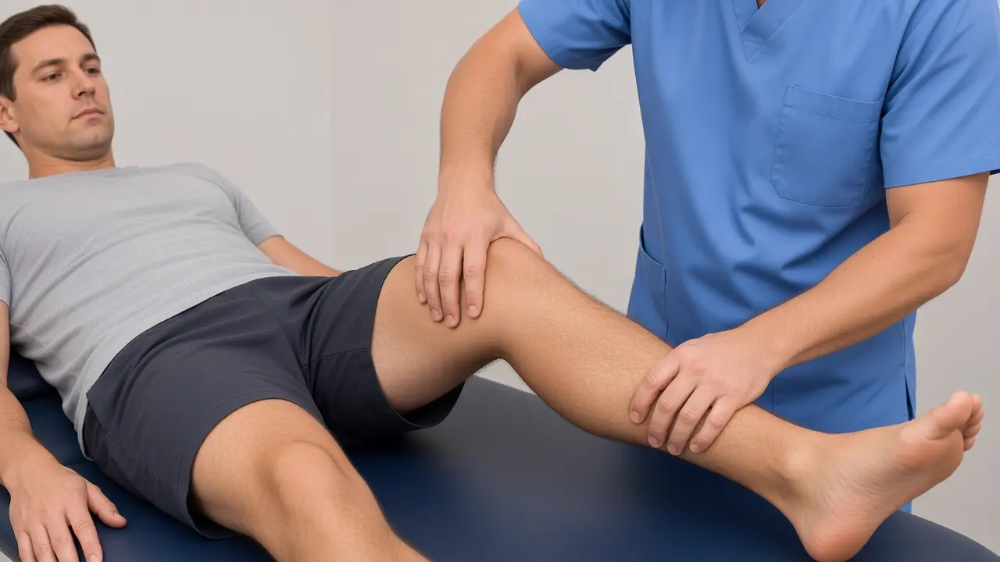
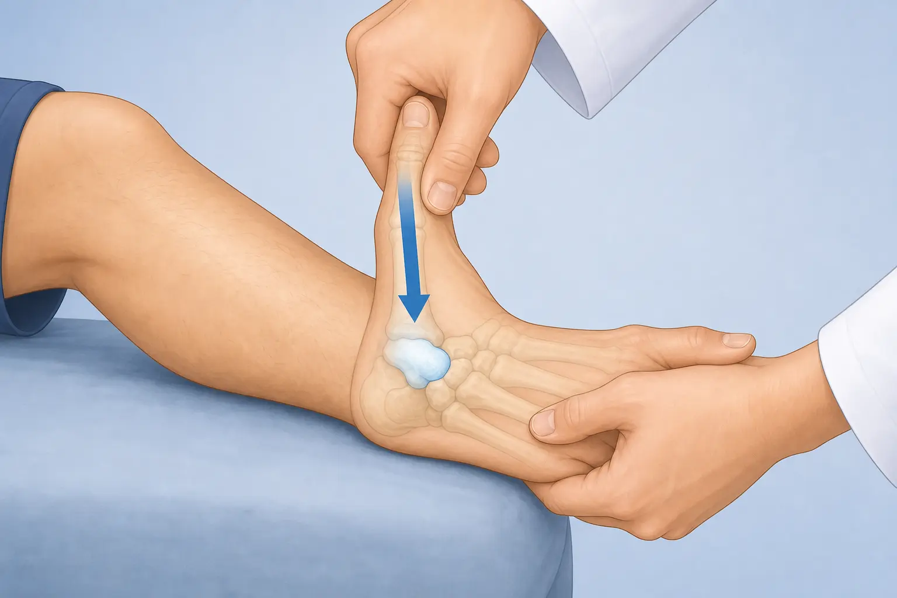

# Missing clinical-test videos (DaVinci AI)

**Status: all 3 missing videos are now shipped** (cross-body, varus-stress-lcl, thumb-axial-load).

Generate these **3** videos. For each one:

1. Open the **initial image** below (or from the path).
2. Paste the **prompt** into DaVinci AI.
3. Export as the **file out** name (`.mp4`).

Images live in `public/clinical-tests/`.

---

## 1. cross-body (shoulder AC)

**Initial image**



**Path:** `public/clinical-tests/cross-body.webp`  
**File out:** `cross-body.mp4`

**Prompt (copy/paste):**

```
Using this illustration as reference, animate the cross-body adduction test (Physiotutors / Chronopoulos): elevate the arm to 90° of forward flexion, then passively guide maximum horizontal adduction across the chest toward the opposite shoulder (elbow ~90° flexed, scarf position). Positive finding is pain on top of the shoulder at the AC joint. CAST LOCK — same two people as Cozen / first Kinora catalog. PATIENT: adult man, short brown hair, clean-shaven, fair skin, heather-grey crew-neck t-shirt, dark charcoal shorts. CLINICIAN: adult man, short dark hair, clean-shaven, fair skin, solid medium-blue V-neck medical scrubs (top and trousers), bare hands. Same light-blue studio, blue treatment table, polished medical-illustration style. FORBIDDEN: different faces, female clinician or patient, polo, khaki, tank top, shirtless, white coat, extra people. Educational physiotherapy demonstration video, soft neutral lighting, anatomically accurate hand placement, no blood, no gore, no logos, no captions, no watermarks, camera steady, 8 seconds.
```

---

## 2. varus-stress-lcl (knee LCL)

**Initial image**



**Path:** `public/clinical-tests/varus-stress-lcl.webp`  
**File out:** `varus-stress-lcl.mp4`

**Prompt (copy/paste):**

```
Using this illustration as reference, animate the knee varus stress test for the LCL: patient supine, knee flexed about 30 degrees, clinician applies gentle varus force opening the lateral joint line. CAST LOCK — same two people as Cozen / first Kinora catalog. PATIENT: adult man, short brown hair, clean-shaven, fair skin, heather-grey crew-neck t-shirt, dark charcoal shorts. CLINICIAN: adult man, short dark hair, clean-shaven, fair skin, solid medium-blue V-neck medical scrubs (top and trousers), bare hands. Same light-blue studio, blue treatment table, polished medical-illustration style. FORBIDDEN: different faces, female clinician or patient, polo, khaki, tank top, shirtless, white coat, extra people. Educational physiotherapy demonstration video, soft neutral lighting, anatomically accurate hand placement, no blood, no gore, no logos, no captions, no watermarks, camera steady, 8 seconds.
```

---

## 3. thumb-axial-load (scaphoid / thumb)

**Initial image** (hand/wrist — NOT foot)



**Path:** `public/clinical-tests/thumb-axial-load.webp`  
**File out:** `thumb-axial-load.mp4`

**Prompt (copy/paste):**

```
Using this illustration as reference, animate axial load of the thumb for scaphoid screening: clinician compresses along the thumb metacarpal toward the wrist/scaphoid. Show a HAND and WRIST only — not a foot. CAST LOCK — same two people as Cozen / first Kinora catalog. PATIENT: adult man, short brown hair, clean-shaven, fair skin, heather-grey crew-neck t-shirt, dark charcoal shorts. CLINICIAN: adult man, short dark hair, clean-shaven, fair skin, solid medium-blue V-neck medical scrubs (top and trousers), bare hands. Same light-blue studio, blue treatment table, polished medical-illustration style. FORBIDDEN: different faces, female clinician or patient, polo, khaki, tank top, shirtless, white coat, extra people. Educational physiotherapy demonstration video, soft neutral lighting, anatomically accurate hand placement, no blood, no gore, no logos, no captions, no watermarks, camera steady, 8 seconds.
```

---

## Absolute paths (Windows)

| Test | Image |
|------|--------|
| cross-body | `c:\Users\sergi\project-ai\public\clinical-tests\cross-body.webp` |
| varus-stress-lcl | `c:\Users\sergi\project-ai\public\clinical-tests\varus-stress-lcl.webp` |
| thumb-axial-load | `c:\Users\sergi\project-ai\public\clinical-tests\thumb-axial-load.webp` |

When the three `.mp4` files are ready, they can be hooked into the clinical-test CDN the same way as the other videos.
