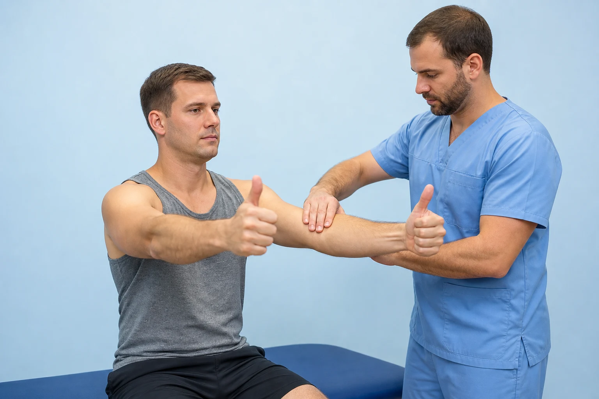
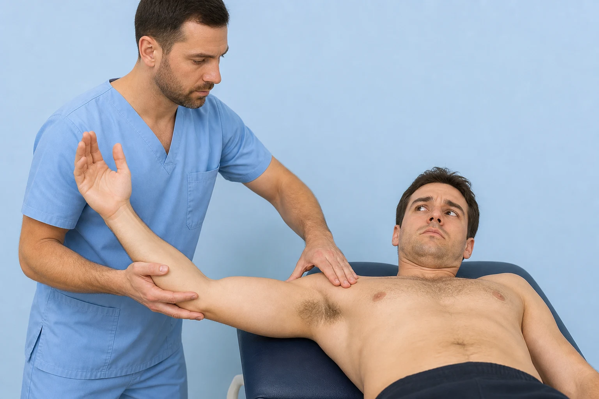
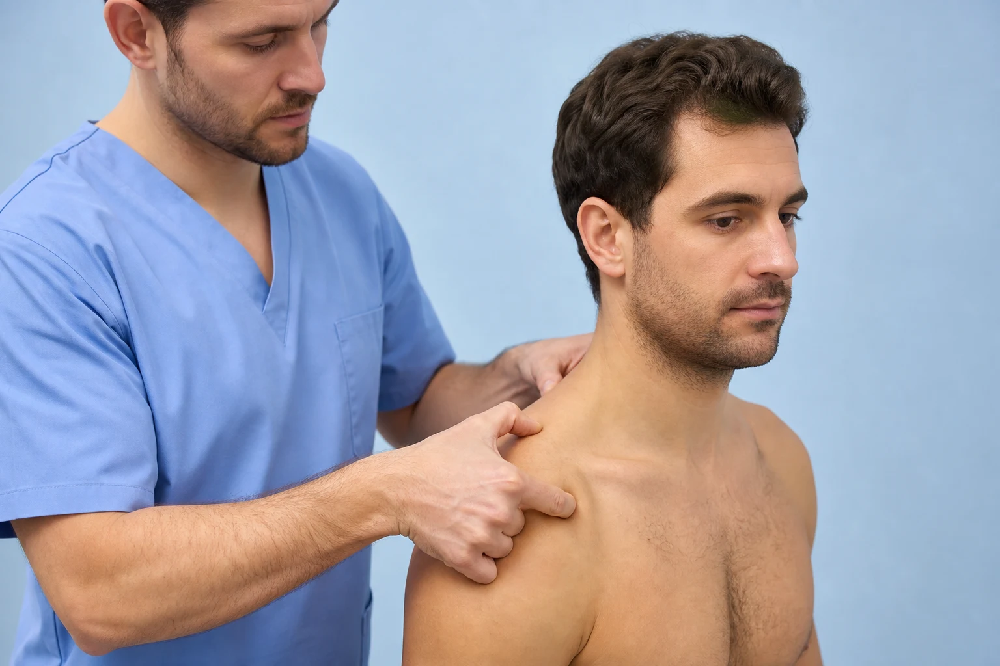
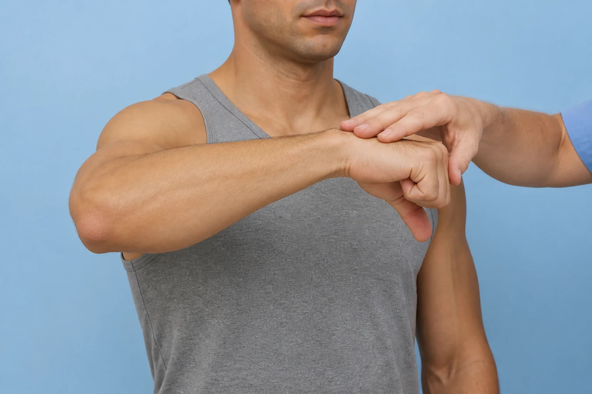
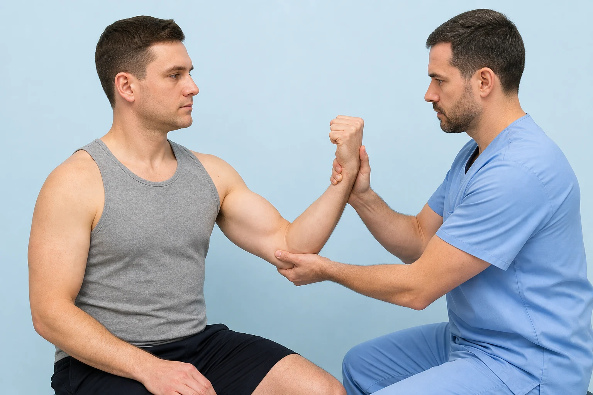
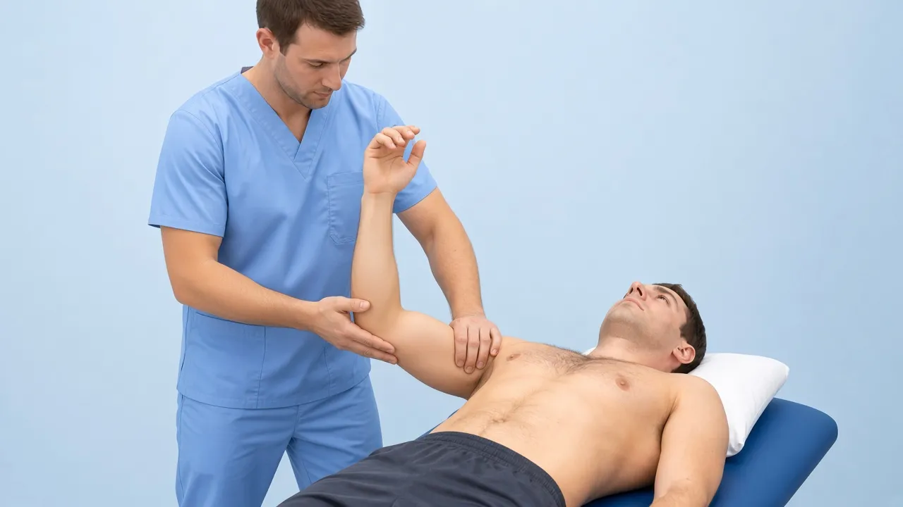
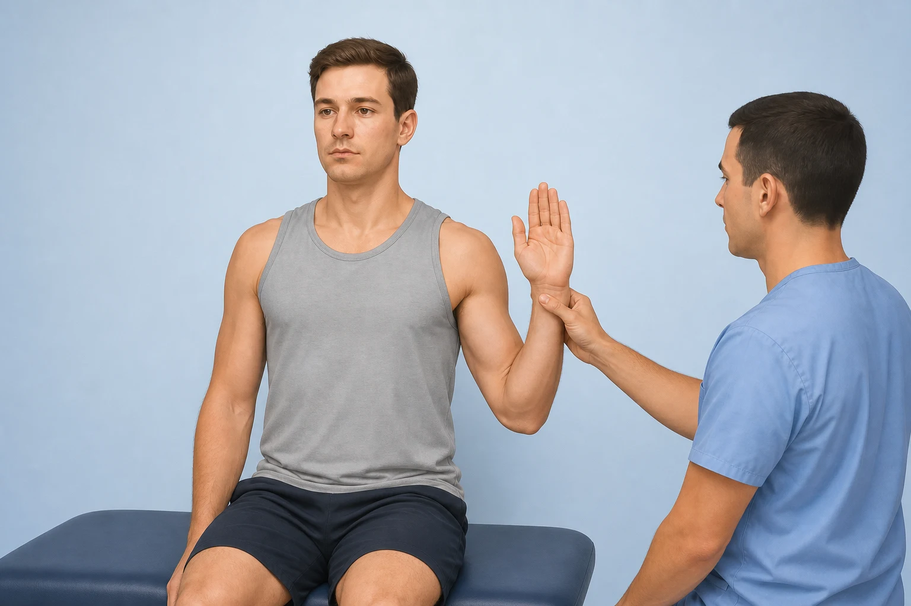
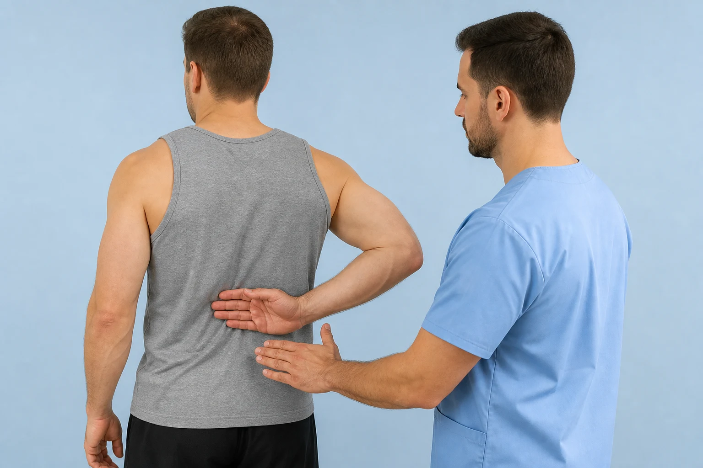
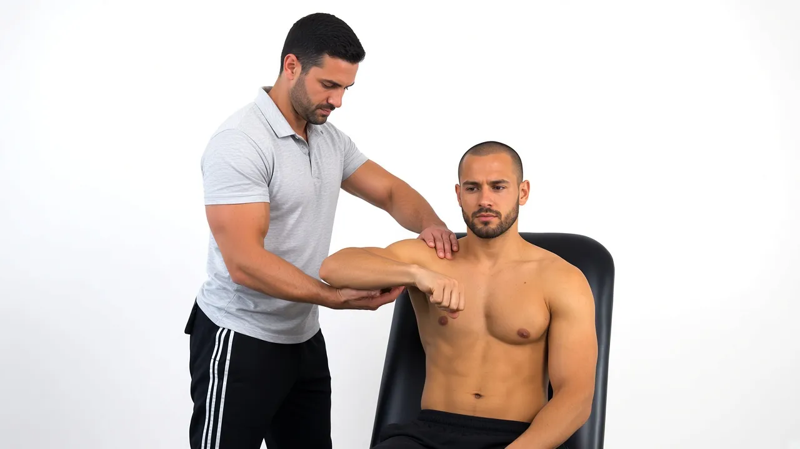
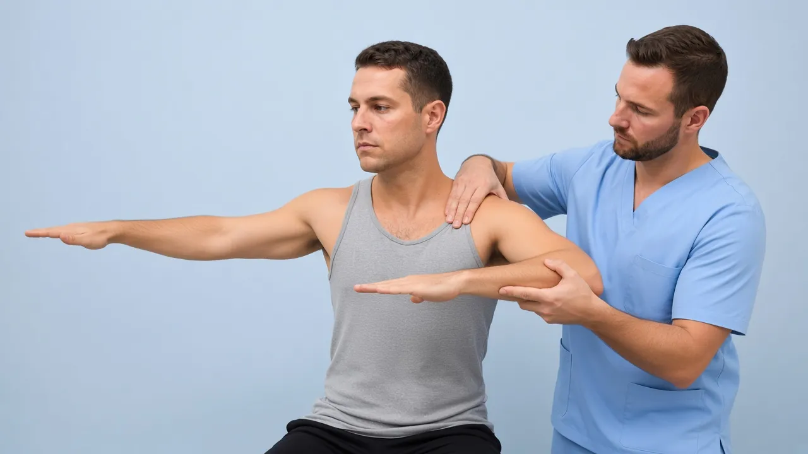

# Shoulder — new tests: initial images + DaVinci / AI video prompts

**Date:** 31 Aug 2026  
**Changelog:** [`knowledge/PHYSIOGUIDE_SHOULDER_EXPANSION_2026-08-31.md`](../../knowledge/PHYSIOGUIDE_SHOULDER_EXPANSION_2026-08-31.md)

Generate **11** videos for the new shoulder catalog entries. For each:

1. Open the **initial image** (path below).
2. Paste the **prompt** into DaVinci AI / Kling / Runway / Luma / Sora (image → video).
3. Export as **File out** (`.mp4`).
4. Optionally fit to 8s demo + 2s logo: `powershell -File scripts/append-kinora-logo-outro.ps1`
5. Upload to the clinical-tests CDN `videos/` bucket (same pattern as existing tests) and add the id to `lib/clinical-test-videos.ts` (+ mobile).

**COMMON_SUFFIX** (already included in each prompt):

> Educational physiotherapy demonstration video, realistic clinic setting, soft neutral lighting, anatomically accurate hand placement, calm professional clinician and patient, no blood, no gore, no logos, no captions, no watermarks, camera steady, 8 seconds.

---

For every new clinical-test video: drop the raw DaVinci `.mp4` into `public/clinical-tests/videos/<id>.mp4`, then run:

```powershell
powershell -File scripts/append-kinora-logo-outro.ps1 -Only <id>.mp4
```

That fits the demo to **8.00s** and appends **2.00s** Kinora logo (`public/logo-icon.png`) → **10.00s** total. Re-runs are safe (uses `.pre-logo-backup`).

Then register the id in `lib/clinical-test-videos.ts` (+ mobile) and upload with `node scripts/upload-clinical-tests-storage.mjs --only videos/<id>.mp4`.

---

## Checklist

| # | id | Initial image | Video out | Status |
|---|-----|---------------|-----------|--------|
| 1 | `full-can` | `full-can.webp` | `full-can.mp4` | image ✅ · video ✅ (+ Kinora logo) |
| 2 | `surprise` | `surprise.webp` | `surprise.mp4` | image ✅ · video ✅ (+ Kinora logo) |
| 3 | `paxinos` | `paxinos.webp` | `paxinos.mp4` | image ✅ · video ✅ (+ Kinora logo) |
| 4 | `obrien` | `obrien.webp` | `obrien.mp4` | image ✅ (regenerated) · video ✅ (+ Kinora logo) |
| 5 | `uppercut` | `uppercut.webp` | `uppercut.mp4` | image ✅ · video ✅ (+ Kinora logo) |
| 6 | `crank` | `crank.webp` | `crank.mp4` | image ✅ · video ✅ (+ Kinora logo) |
| 7 | `er-lag` | `er-lag.webp` | `er-lag.mp4` | image ✅ (regenerated) · video ✅ (+ Kinora logo) |
| 8 | `belly-press` | `belly-press.webp` | `belly-press.mp4` | image ✅ · video ✅ (+ Kinora logo) |
| 9 | `lift-off` | `lift-off.webp` | `lift-off.mp4` | image ✅ · video ✅ (+ Kinora logo) |
| 10 | `kim-test` | `kim-test.webp` | `kim-test.mp4` | image ✅ · video ✅ (+ Kinora logo) |
| 11 | `jerk-test` | `jerk-test.webp` | `jerk-test.mp4` | image ✅ · video ✅ (+ Kinora logo) |

PNG masters also live next to the webps (and under Cursor assets). Prefer **`.webp`** as the animation reference (matches the rest of the catalog).

---

## 1. full-can

**Initial image**



**Path:** `public/clinical-tests/full-can.webp`  
**File out:** `full-can.mp4`

**Prompt (copy/paste):**

```
Using this illustration as reference, animate the Full Can / Jobe thumb-up test: patient elevates both arms to about 90° in the scapular plane with thumbs pointing UP (not down), clinician applies gentle downward resistance on one forearm while the patient resists. Educational physiotherapy demonstration video, realistic clinic setting, soft neutral lighting, anatomically accurate hand placement, calm professional clinician and patient, no blood, no gore, no logos, no captions, no watermarks, camera steady, 8 seconds.
```

---

## 2. surprise

**Initial image**



**Path:** `public/clinical-tests/surprise.webp`  
**File out:** `surprise.mp4`

**Prompt (copy/paste):**

```
Using this illustration as reference, animate the Surprise / Anterior Release test after relocation: patient supine, arm abducted ~90° and externally rotated; clinician first applies posterior pressure on the humeral head (relocation), then gently RELEASES that pressure while supporting the elbow — show the release moment and patient apprehension without forcing dislocation. Educational physiotherapy demonstration video, realistic clinic setting, soft neutral lighting, anatomically accurate hand placement, calm professional clinician and patient, no blood, no gore, no logos, no captions, no watermarks, camera steady, 8 seconds.
```

---

## 3. paxinos

**Initial image**



**Path:** `public/clinical-tests/paxinos.webp`  
**File out:** `paxinos.mp4`

**Prompt (copy/paste):**

```
Using this illustration as reference, animate the Paxinos test for the AC joint: clinician places the thumb on the spine of the scapula and the index finger on the distal clavicle, then gently compresses the acromioclavicular joint with a slow squeeze. Educational physiotherapy demonstration video, realistic clinic setting, soft neutral lighting, anatomically accurate hand placement, calm professional clinician and patient, no blood, no gore, no logos, no captions, no watermarks, camera steady, 8 seconds.
```

---

## 4. obrien

**Initial image**



**Path:** `public/clinical-tests/obrien.webp`  
**File out:** `obrien.mp4`

**Prompt (copy/paste):**

```
Using this illustration as reference, animate the O'Brien / Active Compression test: arm flexed to 90° with slight horizontal adduction (~10–15°), thumb pointing DOWN, patient resists a gentle downward force from the clinician on the forearm; optionally show a brief repeat with thumb UP for comparison. Educational physiotherapy demonstration video, realistic clinic setting, soft neutral lighting, anatomically accurate hand placement, calm professional clinician and patient, no blood, no gore, no logos, no captions, no watermarks, camera steady, 8 seconds.
```

---

## 5. uppercut

**Initial image**



**Path:** `public/clinical-tests/uppercut.webp`  
**File out:** `uppercut.mp4`

**Prompt (copy/paste):**

```
Using this illustration as reference, animate the Uppercut test for the long head of biceps: elbow flexed, forearm supinated, patient performs a short upward punch / uppercut motion while the clinician resists at the fist or distal forearm. Educational physiotherapy demonstration video, realistic clinic setting, soft neutral lighting, anatomically accurate hand placement, calm professional clinician and patient, no blood, no gore, no logos, no captions, no watermarks, camera steady, 8 seconds.
```

---

## 6. crank

**Initial image**



**Path:** `public/clinical-tests/crank.webp`  
**File out:** `crank.mp4`

**Prompt (copy/paste):**

```
Using this illustration as reference, animate the Crank test (labral screening): patient supine, shoulder abducted about 90–120°, clinician applies axial compression through the humerus toward the glenoid while gently rotating the arm internally and externally. Educational physiotherapy demonstration video, realistic clinic setting, soft neutral lighting, anatomically accurate hand placement, calm professional clinician and patient, no blood, no gore, no logos, no captions, no watermarks, camera steady, 8 seconds.
```

---

## 7. er-lag

**Initial image**



**Path:** `public/clinical-tests/er-lag.webp`  
**File out:** `er-lag.mp4`

**Prompt (copy/paste):**

```
Using this illustration as reference, animate the External Rotation Lag Sign: elbow flexed ~90° at the side, clinician passively places the forearm in maximum external rotation, then releases support slightly so the patient must hold the position — show a small lag/fall toward internal rotation if unable to hold. Educational physiotherapy demonstration video, realistic clinic setting, soft neutral lighting, anatomically accurate hand placement, calm professional clinician and patient, no blood, no gore, no logos, no captions, no watermarks, camera steady, 8 seconds.
```

---

## 8. belly-press

**Initial image**


**Path:** `public/clinical-tests/belly-press.webp`  
**File out:** `belly-press.mp4`

**Prompt (copy/paste):**

```
Using this illustration as reference, animate the Belly Press / Napoleon test for subscapularis: patient presses the palm firmly into the abdomen while keeping the elbow forward in front of the trunk; show the press and keeping the elbow from falling backward. Educational physiotherapy demonstration video, realistic clinic setting, soft neutral lighting, anatomically accurate hand placement, calm professional clinician and patient, no blood, no gore, no logos, no captions, no watermarks, camera steady, 8 seconds.
```

---

## 9. lift-off

**Initial image**



**Path:** `public/clinical-tests/lift-off.webp`  
**File out:** `lift-off.mp4`

**Prompt (copy/paste):**

```
Using this illustration as reference, animate the Lift-off / Gerber test: patient's hand placed on the low back (lumbar region), then actively lifts the hand away from the back against gravity (or light clinician resistance), viewed from behind/side. Educational physiotherapy demonstration video, realistic clinic setting, soft neutral lighting, anatomically accurate hand placement, calm professional clinician and patient, no blood, no gore, no logos, no captions, no watermarks, camera steady, 8 seconds.
```

---

## 10. kim-test

**Initial image**



**Path:** `public/clinical-tests/kim-test.webp`  
**File out:** `kim-test.mp4`

**Prompt (copy/paste):**

```
Using this illustration as reference, animate the Kim test for posterior shoulder instability: arm flexed about 90°, adducted toward the midline and internally rotated; clinician applies a posterior-directed load on the proximal humerus toward the glenoid with a controlled push. Educational physiotherapy demonstration video, realistic clinic setting, soft neutral lighting, anatomically accurate hand placement, calm professional clinician and patient, no blood, no gore, no logos, no captions, no watermarks, camera steady, 8 seconds.
```

---

## 11. jerk-test

**Initial image**



**Path:** `public/clinical-tests/jerk-test.webp`  
**File out:** `jerk-test.mp4`

**Prompt (copy/paste):**

```
Using this illustration as reference, animate the Jerk test for posterior shoulder instability: arm flexed ~90°, adducted and internally rotated; clinician applies axial compression through the humerus into the glenoid (jerk/compression), with a short controlled loading motion. Educational physiotherapy demonstration video, realistic clinic setting, soft neutral lighting, anatomically accurate hand placement, calm professional clinician and patient, no blood, no gore, no logos, no captions, no watermarks, camera steady, 8 seconds.
```

---

## Absolute paths (Windows)

| Test | Image |
|------|--------|
| full-can | `c:\Users\sergi\project-ai\public\clinical-tests\full-can.webp` |
| surprise | `c:\Users\sergi\project-ai\public\clinical-tests\surprise.webp` |
| paxinos | `c:\Users\sergi\project-ai\public\clinical-tests\paxinos.webp` |
| obrien | `c:\Users\sergi\project-ai\public\clinical-tests\obrien.webp` |
| uppercut | `c:\Users\sergi\project-ai\public\clinical-tests\uppercut.webp` |
| crank | `c:\Users\sergi\project-ai\public\clinical-tests\crank.webp` |
| er-lag | `c:\Users\sergi\project-ai\public\clinical-tests\er-lag.webp` |
| belly-press | `c:\Users\sergi\project-ai\public\clinical-tests\belly-press.webp` |
| lift-off | `c:\Users\sergi\project-ai\public\clinical-tests\lift-off.webp` |
| kim-test | `c:\Users\sergi\project-ai\public\clinical-tests\kim-test.webp` |
| jerk-test | `c:\Users\sergi\project-ai\public\clinical-tests\jerk-test.webp` |

When the eleven `.mp4` files are ready, hook them in `lib/clinical-test-videos.ts` (+ mobile) and upload to the CDN `videos/` folder with the same cache-bust pattern as existing entries.
