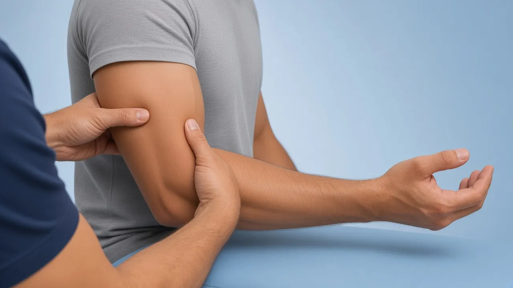

# Missing thin tests — 3 starter frames + DaVinci AI prompts

**Date:** 3 Sep 2026  
**Priority videos:** PLRI chair, biceps squeeze, TFCC press test

For each:

1. Open the **initial image** (path below).
2. Paste the **prompt** into DaVinci AI (image → video).
3. Export as **File out** (`.mp4`) into `public/clinical-tests/videos/`.
4. Fit to 8s demo + 2s logo:

```powershell
powershell -File scripts/append-kinora-logo-outro.ps1 -Only <id>.mp4
```

5. Register id in `lib/clinical-test-images.ts` + `lib/clinical-test-videos.ts` (+ mobile), then upload:

```powershell
node scripts/upload-clinical-tests-storage.mjs --only videos/<id>.mp4,<id>.webp
```

**COMMON_SUFFIX** (already included in each prompt):

> CAST LOCK — same two people as Cozen / first Kinora catalog. PATIENT: adult man, short brown hair, clean-shaven, fair skin, heather-grey crew-neck t-shirt, dark charcoal shorts. CLINICIAN: adult man, short dark hair, clean-shaven, fair skin, solid medium-blue V-neck medical scrubs (top and trousers), bare hands. Same light-blue studio, blue treatment table, polished medical-illustration style. FORBIDDEN: different faces, female clinician or patient, polo, khaki, tank top, shirtless, white coat, extra people. Educational physiotherapy demonstration video, soft neutral lighting, anatomically accurate hand placement, no blood, no gore, no logos, no captions, no watermarks, camera steady, 8 seconds.

---

## Checklist

| # | id | Initial image | Video out | Status |
|---|-----|---------------|-----------|--------|
| 1 | `chair-push-plri` | `chair-push-plri-start.png` | `chair-push-plri.mp4` | image ✅ · video ✅ (65 armrests + Kinora logo) |
| 2 | `biceps-squeeze` | `biceps-squeeze-start.png` | `biceps-squeeze.mp4` | image ✅ · video ✅ (60 + Kinora logo) |
| 3 | `press-test` | `press-test.png` | `press-test.mp4` | image ✅ · video ✅ (+ Kinora logo) |

---

## 1. chair-push-plri (PLRI chair sign / Stand-up test)

**Refs:** Physiotutors Stand-Up / Chair Push-Up — [youtube.com/watch?v=81yiXiPwhNs](https://www.youtube.com/watch?v=81yiXiPwhNs)

**DaVinci upload (START):** `c:\Users\sergi\project-ai\public\clinical-tests\chair-push-plri-start.png`  
**Optional END:** `c:\Users\sergi\project-ai\public\clinical-tests\chair-push-plri-end.png`  
**File out:** `chair-push-plri.mp4`

**Movement:** seated on a chair **with armrests (reposabrazos)**; hands on the **armrests** (not the seat); elbows ~90°, forearms **supinated**; push body up from the armrests.

**Prompt (copy/paste):**

```
Using this illustration as reference, animate the Stand-Up / Chair Push-Up Test for PLRI EXACTLY like Physiotutors (81yiXiPwhNs). Patient SEATED on a chair that HAS ARMRESTS (reposabrazos).

START (0–1s): both hands on the ARMRESTS (not on the seat cushion), elbows flexed ~90°, shoulders slightly abducted, BOTH forearms SUPINATED (palms up on the armrests).

MOTION (1–7s): patient pushes himself UP from the chair using the ARMRESTS — buttocks lift off the seat, elbows extend as he rises. Hands stay on the ARMRESTS the whole time. Forearms stay SUPINATED.

END (7–8s): hold the raised push-up position briefly (or nearly standing supported on the armrests).

CRITICAL: hands on the ARMRESTS / reposabrazos — NEVER on the seat. Do NOT show a full elbow dislocation. Camera steady, 8 seconds, no logos, no captions, no watermarks, no anatomical overlays.
```

**Ultra-short:**

```
Chair push-up PLRI: hands on chair ARMRESTS (reposabrazos), elbows 90°, forearms supinated, push body up off the seat. Not on the seat cushion. 8s, no text.
```

---

## 2. biceps-squeeze

**Initial image** (no arrow — avoid pronation confusion)



**Path:** `public/clinical-tests/biceps-squeeze.webp`  
**DaVinci upload:** `c:\Users\sergi\project-ai\public\clinical-tests\biceps-squeeze-start.png`  
**File out:** `biceps-squeeze.mp4`

**CRITICAL:** response motion is **SUPINACIÓN** (palm turns UP / outward) — NEVER pronación (palm down).

**Prompt (copy/paste):**

```
Using this illustration as reference, animate the biceps squeeze test (Ruland / distal biceps). Patient seated, elbow flexed ~60–80°, forearm starts slightly PRONATED (palm somewhat down). Clinician firmly SQUEEZES the biceps muscle belly with both hands.

CRITICAL MOVEMENT — SUPINACIÓN ONLY:
When the biceps is squeezed, the forearm passively SUPINATES — the palm / thumb rotate UPWARD and OUTWARD (supination). You must clearly see the hand turn toward palm-up.
FORBIDDEN: pronación — do NOT turn the palm downward or inward. Do NOT flip the wrong way.

0–1s: hold start (slight pronation). 1–5s: squeeze biceps → clear SUPINATION of the forearm. 5–8s: hold or gently release while forearm stays toward palm-up.

Educational physiotherapy demonstration, soft neutral lighting, calm clinician and patient, no blood, no gore, no logos, no captions, no watermarks, camera steady, 8 seconds.
```

**Shorter alt:**

```
Biceps squeeze: squeeze muscle belly. Forearm response = SUPINATION only (palm turns UP). Never pronation. Camera steady, 8s, no text.
```

---

## 3. press-test (Lester TFCC)

**Initial image**


**Path:** `public/clinical-tests/press-test.png`  
**File out:** `press-test.mp4`

**Prompt (copy/paste):**

```
Using this illustration as reference, animate the Lester press test for TFCC / ulnar wrist pain: patient's forearm and hand rest on a treatment table; the patient presses the ulnar border / hypothenar region of the hand firmly down into the table (axial ulnar load), holds briefly, then releases; pain at the ulnar wrist is the familiar finding — do not dramatize. Optional soft cyan highlight of the TFCC at the ulnar wrist. CAST LOCK — same two people as Cozen / first Kinora catalog. PATIENT: adult man, short brown hair, clean-shaven, fair skin, heather-grey crew-neck t-shirt, dark charcoal shorts. CLINICIAN: adult man, short dark hair, clean-shaven, fair skin, solid medium-blue V-neck medical scrubs (top and trousers), bare hands. Same light-blue studio, blue treatment table, polished medical-illustration style. FORBIDDEN: different faces, female clinician or patient, polo, khaki, tank top, shirtless, white coat, extra people. Educational physiotherapy demonstration video, soft neutral lighting, anatomically accurate hand placement, no blood, no gore, no logos, no captions, no watermarks, camera steady, 8 seconds.
```
