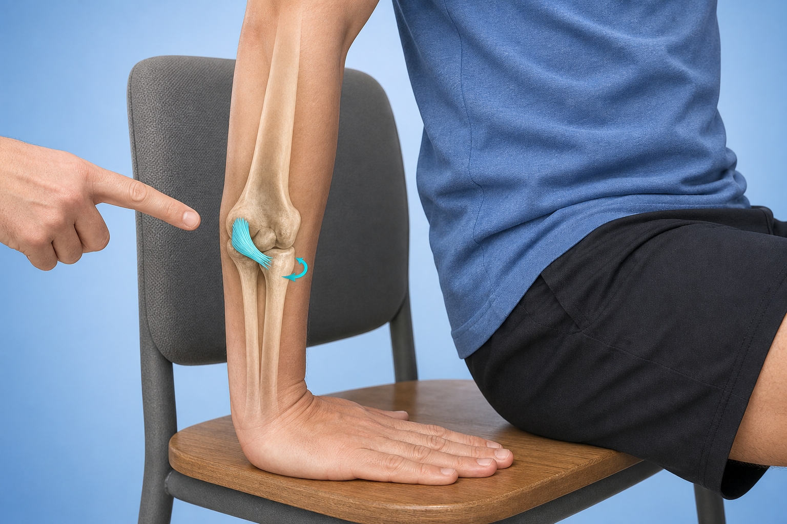

# Missing thin tests — 3 starter frames + DaVinci AI prompts

**Date:** 3 Sep 2026  
**Priority videos:** PLRI chair, biceps squeeze, TFCC press test

For each:

1. Open the **initial image** (path below).
2. Paste the **prompt** into DaVinci AI (image → video).
3. Export as **File out** (`.mp4`) into `public/clinical-tests/videos/`.
4. Fit to 8s demo + 2s logo:

```powershell
powershell -File scripts/append-kinora-logo-outro.ps1 -Only <id>.mp4
```

5. Register id in `lib/clinical-test-images.ts` + `lib/clinical-test-videos.ts` (+ mobile), then upload:

```powershell
node scripts/upload-clinical-tests-storage.mjs --only videos/<id>.mp4,<id>.webp
```

**COMMON_SUFFIX** (already included in each prompt):

> Educational physiotherapy demonstration video, realistic clinic setting, soft neutral lighting, anatomically accurate hand placement, calm professional clinician and patient, no blood, no gore, no logos, no captions, no watermarks, camera steady, 8 seconds.

---

## Checklist

| # | id | Initial image | Video out | Status |
|---|-----|---------------|-----------|--------|
| 1 | `chair-push-plri` | `chair-push-plri.png` | `chair-push-plri.mp4` | image ✅ · video ✅ (+ Kinora logo) |
| 2 | `biceps-squeeze` | `biceps-squeeze.png` | `biceps-squeeze.mp4` | image ✅ · video ✅ (+ Kinora logo) |
| 3 | `press-test` | `press-test.png` | `press-test.mp4` | image ✅ · video ✅ (+ Kinora logo) |

---

## 1. chair-push-plri (PLRI chair sign)

**Initial image**



**Path:** `public/clinical-tests/chair-push-plri.png`  
**File out:** `chair-push-plri.mp4`

**Prompt (copy/paste):**

```
Using this illustration as reference, animate the PLRI chair push-up / chair sign: adult patient sits on a clinic chair and presses both hands (or the symptomatic side) flat on the chair seat beside the hips with the forearm SUPINATED (palm facing up) and elbows nearly extended, then gently pushes the body upward as if rising from the chair; stop if posterolateral elbow apprehension appears — do NOT show a full dislocation. Optional soft cyan highlight on the lateral elbow / LUCL. Educational physiotherapy demonstration video, realistic clinic setting, soft neutral lighting, anatomically accurate hand placement, calm professional clinician and patient, no blood, no gore, no logos, no captions, no watermarks, camera steady, 8 seconds.
```

---

## 2. biceps-squeeze

**Initial image**


**Path:** `public/clinical-tests/biceps-squeeze.png`  
**File out:** `biceps-squeeze.mp4`

**Prompt (copy/paste):**

```
Using this illustration as reference, animate the distal biceps squeeze test (Ruland): patient seated or standing with elbow flexed about 60–80°, forearm relaxed and semi-pronated; clinician firmly squeezes the biceps muscle belly with both hands; if the tendon is intact the forearm shows a clear passive SUPINATION motion — show that small outward turn of the palm, then release. Optional soft cyan ghost of the distal biceps tendon. Educational physiotherapy demonstration video, realistic clinic setting, soft neutral lighting, anatomically accurate hand placement, calm professional clinician and patient, no blood, no gore, no logos, no captions, no watermarks, camera steady, 8 seconds.
```

---

## 3. press-test (Lester TFCC)

**Initial image**


**Path:** `public/clinical-tests/press-test.png`  
**File out:** `press-test.mp4`

**Prompt (copy/paste):**

```
Using this illustration as reference, animate the Lester press test for TFCC / ulnar wrist pain: patient's forearm and hand rest on a treatment table; the patient presses the ulnar border / hypothenar region of the hand firmly down into the table (axial ulnar load), holds briefly, then releases; pain at the ulnar wrist is the familiar finding — do not dramatize. Optional soft cyan highlight of the TFCC at the ulnar wrist. Educational physiotherapy demonstration video, realistic clinic setting, soft neutral lighting, anatomically accurate hand placement, calm professional clinician and patient, no blood, no gore, no logos, no captions, no watermarks, camera steady, 8 seconds.
```
